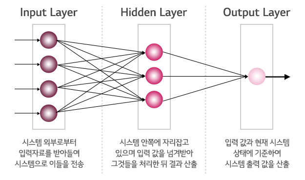
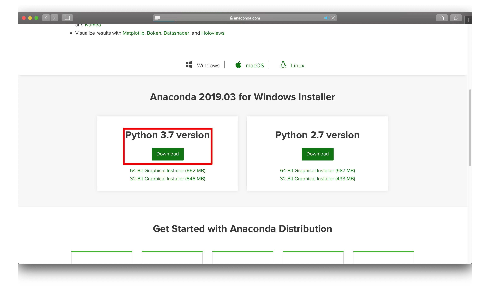
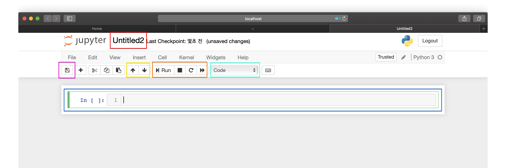
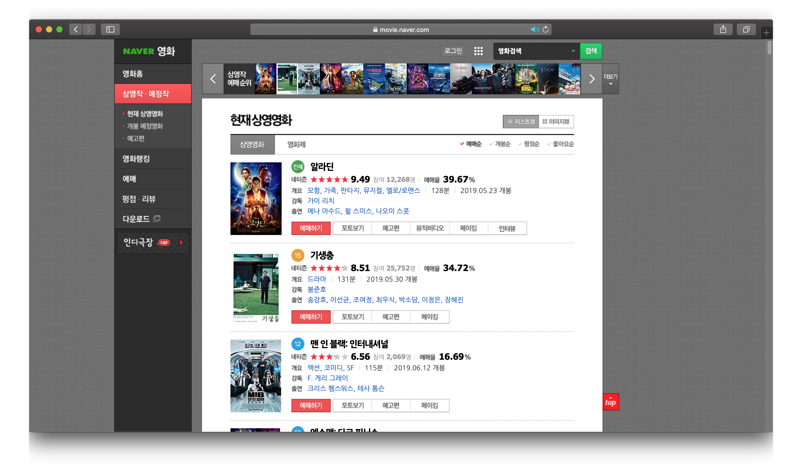
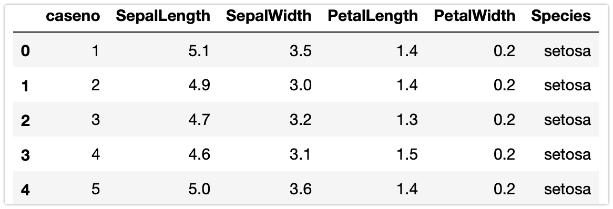
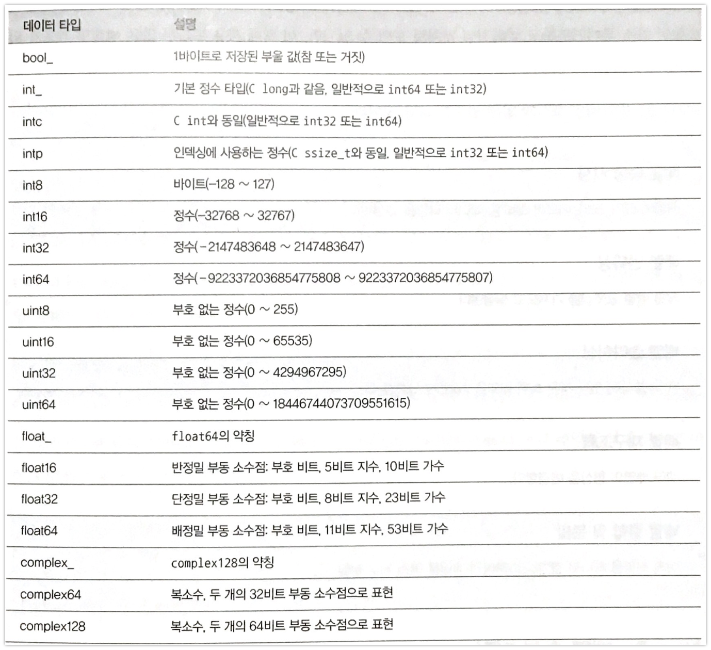
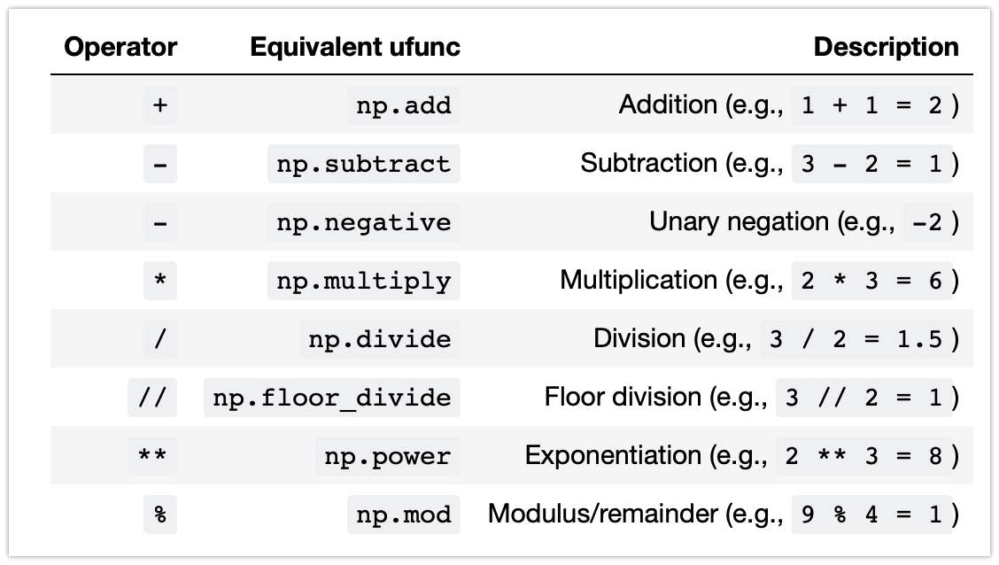
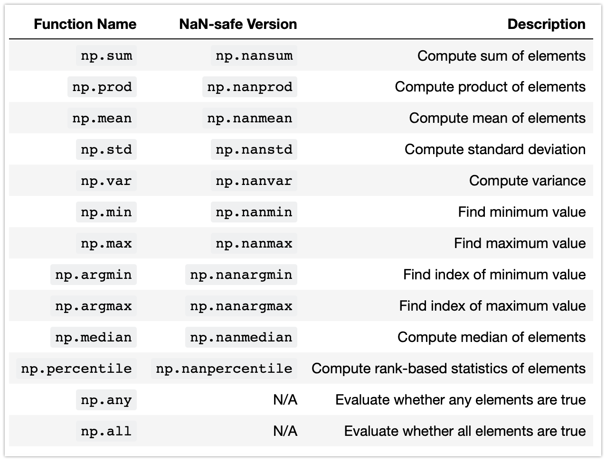
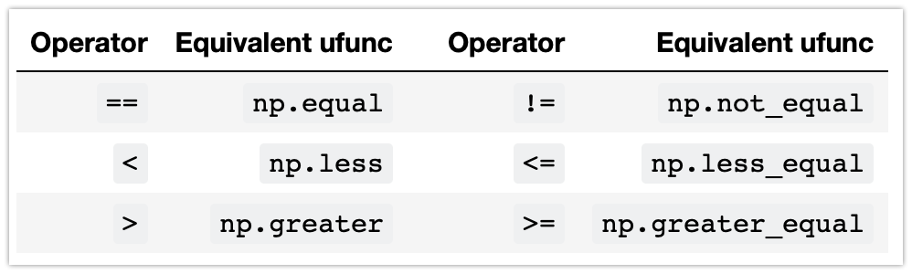

# 용어 정리

## 빅데이터

빅 데이터(영어: big data)란 기존 데이터베이스 관리도구의 능력을 넘어서는 대량(수십 테라바이트)의 정형 또는 심지어 데이터베이스 형태가 아닌 비정형의 데이터 집합조차 포함한 **데이터로부터 가치를 추출하고 결과를 분석하는 기술**이다. 

### 빅데이터의 특징

- 볼륨 (Volume) : 데이터 규모는 테라바이트에서 페타바이트에 이른다
- 다양성 (Variety) : 다양한 소스 및 형식의 데이터를 포함한다(예: 웹 로그, 소셜 미디어 상호 작용, 전자 상거래 및 온라인 트랜잭션, 금융 트랜잭션 등).
- 속도 (Velocity) : 데이터는 하루 단위에서 실시간에 이르기까지 상대적으로 짧은 시간 내에 수집, 저장, 처리 및 분석되어야 한다.
- 정확성 (Veracity) : 빅데이터를 분석하는 데 있어 기업이나 기관에 수집한 데이터가 정확한 것인지, 분석할 만한 가치가 있는지 등을 살펴야 하는 필요성이 생겼고 이러한 측면에서 빅데이터의 새로운 속성인 정확성(Veracity)이 제시되고 있다.
- 가변성 (Variability) :  데이터가 맥락에 따라 의미가 달라진다고 하여 빅데이터의 새로운 속성으로 가변성(Variability)이 제시되고 있다(위치정보 데이터의 위치 기반 서비스 활용과 개인 정보 유출의 측면).
- 시각화 (Visualization) : 빅데이터는 정형 및 비정형 데이터를 수집하여 복잡한 분석을 실행한 후 용도에 맞게 정보를 가공하는 과정을 거친다. 이때 중요한 것은 정보의 사용 대상자가 쉽게 이해하기 위해 데이터를 시각화 한다.


## 데이터 과학(데이터 사이언스)

데이터 과학(data science)이란, 데이터 마이닝(Data Mining)과 유사하게 정형, 비정형 형태를 포함한 **다양한 데이터로부터 지식과 인사이트를 추출하는데 과학적 방법론, 프로세스, 알고리즘, 시스템을 동원하는 융합분야**다.

사용되는 기술은 여러분야에 걸쳐있으며 수학, 통계학, 계산기과학, 정보공학, 패턴인식, **기계학습**, 데이터마이닝, 데이터베이스 등과 관련이 있다. 데이터 과학을 연구하는 사람을 데이터 과학자라고 한다.


## 머신러닝

기계 학습(機械學習) 또는 머신 러닝(영어: machine learning)은 인공 지능의 한 분야로, 컴퓨터가 학습할 수 있도록 하는 알고리즘과 기술을 개발하는 분야를 말한다. 가령, 기계 학습을 통해서 수신한 이메일이 스팸인지 아닌지를 구분할 수 있도록 훈련할 수 있다.

> Arthur Samuel은 머신 러닝을 “컴퓨터에게 명시적으로 프로그래밍 하지 않고 학습을 할수 있는 능력을 주는 연구 분야”라고 정의하였다. 다시 말하면 머신 러닝 프로그램은 앞서 언급했던 if-then과 같은 구문을 명시적으로 컴퓨터에 프로그래밍하는 것이 아니라 **머신 러닝 프로그램이 경험한 데이터에 대한 반응으로 스스로를 변경**하는 것이다 (이것은 마치 **아이가 아무것도 모르는 채 세상에 태어나서 그들이 경험한 것을 바탕으로 세상을 이해하게 되는 것과 같은 이치**이다)

### 0과 1을 구분하는 규칙 / 법칙은?


## 딥러닝

딥 러닝(영어: deep learning)은 기계학습(machine learning) 알고리즘의 집합으로 정의되며, 큰 틀에서 사람의 사고방식을 컴퓨터에게 가르치는 기계학습의 한 분야라고 이야기할 수 있다. **사람의 신경체를 모델링하여 여러 층으로 구성하여 학습**시키는 방법




# 개발 환경

## Anaconda

Anaconda는 데이터 정형화 및 분석을 위한 파이썬 모듈을 제공하는 패키지이다. 다음 링크에서 다운로드 할 수 있다.

링크 : https://www.anaconda.com/distribution/#download-section



## Jupyter Notebook

웹 기반의 프로그래밍 코드 및 공유 문서 작성을 위한 오픈소스 에디터 프로그램이다. 데이터 시각화, 머신러닝 관련 작업을 간단하게 할 수 있는 장점이 있다. Anaconda 패키지를 설치하면 같이 설치 된다.


### 실행

- 윈도우즈

  - 시작 > 모든프로그램 > anaconda > jupyter notebook 실행

  - anaconda-nevigator 실행 > 화면에서  jupyter notebook 선택

  - 명령프롬프트(커맨드라인) 실행 > jupyter notebook 입력 

    

- Mac 

  - anaconda-nevigator 실행 > 화면에서  jupyter notebook 선택
  - 터미널(terminal) 실행 > Jupiter notebook 입력 


### 실행화면




# 데이터 다루기

## 웹에서 데이터 읽어오기

데이터가 공개되어 있지 않거나 테이블의 형태로 정형화 되어 있지 않은 데이터를 비정형 데이터라 한다. 웹사이트에 표시되는 정보(텍스트, 이미지 등)가 대표적인 비정형 데이터로 이러한 웹페이지에 표시된 데이터를 읽어 저장하는 기법을 웹 스크래핑 혹은 웹 크롤링이라 한다.  

- BeautifulSoup은 웹페이지를 구성하는 HTML 문서를 파싱(Parsing)하여 데이터를 추출해내는 파이썬 모듈.


다음 코드는 네이버 영화 사이트에서 영화 제목을 추출하는 코드이다.



```python
from bs4 import BeautifulSoup
from urllib.request import urlopen

url = urlopen("https://movie.naver.com/movie/running/current.nhn")
soup = BeautifulSoup(url, "lxml")

wrap = soup.find("div", {"class":"lst_wrap"}) 
titles = wrap.find_all("dt", {"class":"tit"})
title = []
for t in titles:
	title.append(t.find('a').text)

print(title)
```


## CSV 파일에서 데이터 읽어오기

CSV는 정형 덱스트 파일 포맷으로 행(Row)과 열(Column)로 이루어진 데이터프레임에 맞추어 데이터를 저장한다.

```python
import pandas as pd

iris = pd.read_csv('./data/iris.csv')
iris.head()
```

 


# NumPy 소개

Numpy는 파이썬에서 인메모리 데이터를 효과적으로 적재 / 저장하고 가공하는 모듈이다. 텍스트, 숫자, 이미지 등을 다양한 차원의 **숫자의 배열(array)로 구성**하고 계산하는 다양한 함수들을 제공한다.   

다음의 코드로 numpy 모듈을 임포트한다.

```python
import numpy as np
```


## 배열 (array)

numpy의 기본 자료형은 배열이다. 파이썬도 리스트가 있지만 numpy는 다차원의 데이터를 다룰 때 효율적인 연산이 추가된다. 다만 배열의 모든 요소는 같은 타입의 자료이어야 한다.

```python
np.array([3.14,4,2,1])

np.array(['apple', 'samsung', 0, 1.2]) # 데이터 타입이 변환된다.
```


## 처음부터 배열 만들기

규모가 큰 배열의 경우 numpy에 내장된 루틴을 활용해 처음부터 배열을 생성하는 것이 효율적이다(이후 실습에 주로 활용).

```python
np.arange(0, 20, 2) # 0에서 20 이전 까지 2씩 더해 채움

np.linspace(0,1,5) # 0에서 1 사이에 일정한 간격을 가진 5개의 값으로 채운 배열 생성

np.random.random((3,3)) # 0~1 사이의 난수로 3행 3열의 배열 생성

np.random.normal(0, 1, (3,3)) # 정규분포(평균:0, 편차:1)의 난수로 채운 3행 3열 배열 생성
np.random.randn(3,3) # 위와 동일

np.random.randint(0,10,(3,3)) # 0에서 10 이전까지의 정수로 3행 3열 배열 생성

```


## Numpy 데이터 타입




## 배열 속성 지정

유용한 배열 속성과 다양한 차원의 배열을 정의해 보자

```python
import numpy as np
np.random.seed(0)  # 재현 가능성을 위한 시드 값

x1 = np.random.randint(10, size=6)  # 1차원 배열
x2 = np.random.randint(10, size=(3, 4))  # 2차원 배열
x3 = np.random.randint(10, size=(3, 4, 5))  # 3차원 배열

print("x3 ndim: ", x3.ndim) # 차원의 개수
print("x3 shape:", x3.shape) # 각 차원의 크기
print("x3 size: ", x3.size) # 전체 배열 크기
print("x3 dtype: ", x3.dtype) # 데이터 타입
```


출처 : https://www.oreilly.com/library/view/elegant-scipy/9781491922927/assets/elsp_0105.png


## 배열 인덱싱 / 슬라이싱

Numpy의 인덱싱도 파이썬의 리스트와 마찬가지로 0부터 시작하여 마지막까지 접근 할 수 있고 중괄호 안에 원하는 인덱스를 지정하면 된다.

```python
x1
x1[0] # 5
x1[4] # 7

x2
x2[0,0]
x2[2,-1]
```


Numpy에서 슬라이싱은 다음 구문을 활용한다.

- x[start : stop : step]

start, stop, step 이 지정되지 않으면 기본으로 start = 0, stop = 차원 크기, step = 1으로 값이 설정된다.

```python
x = np.arange(10)
x
x[:5]  # 첫 다섯 개의 요소
x[5:]  # 인덱스 5 다음의 요소들
x[4:7]  # 중간 하위 배열
x[::2]  # 하나 걸러 하나씩의 요소들로 구성된 배열
x[1::2]  # 인덱스 1로부터 시작하여 하나 걸러 하나씩 요소들로 구성된 배열
x[::-1]  # 모든 요소들을 거꾸로 나열
x[5::-2]  # 인덱스 5부터 하나 걸러 하나씩 요소들을 거꾸로 나열
```

다차원인 경우

```python
x2
x2[:2, :3]  # 두 개의 행, 세 개의 열
x2[:3, ::2]  # 모든 행, 한 열 걸러 하나씩
x2[::-1, ::-1] # 행과 열이 반전된다.
```


## 배열의 재구조화

```python
grid = np.arange(1, 10) # 1차원 배열
grid = grid.reshape((3, 3)) # 3 x 3 의 2차원 배열로 재구성
print(grid)

x = np.array([1, 2, 3])

x.reshape((1, 3)) # reshape 을 이용한 1행 3열의 벡터로 구조화
```


# NumPy의 배열연산 : 유니버설 함수

Numpy는 반복적인 배열의 계산을 벡터화 연산(Vectorized)을 이용한 유니버설 함수를 통해 빠르게 계산할 수 있다.  아래 그림은 벡터화 연산에 대한 개념도이다.


출처 : https://datascience.blog.wzb.eu/2018/02/02/vectorization-and-parallelization-in-python-with-numpy-and-pandas/


## 루프와 벡터화 연산 비교

다음코드는 배열의 값을 역수로 취하는 계산을 수행한다.

```python
import numpy as np
np.random.seed(0)

def compute_reciprocals(values):
    output = np.empty(len(values))
    for i in range(len(values)):
        output[i] = 1.0 / values[i]
    return output

# 만든 함수를 실행
values = np.random.randint(1, 10, size=5)
compute_reciprocals(values)

# 함수를 실행하면서 시간을 측정해보자
big_array = np.random.randint(1, 100, size=1000000)
%timeit compute_reciprocals(big_array)

# 벡터화 연산
%timeit (1.0 / big_array)
```


## NumPy의 유니버설 함수

### 배열 산술 연산

```python
x = np.arange(4)

print("x     =", x)
print("x + 5 =", x + 5)
print("x - 5 =", x - 5)
print("x * 2 =", x * 2)
print("x / 2 =", x / 2)
print("x // 2 =", x // 2)  # 바닥 나눗셈(나머지는 버림)
print("-x     = ", -x)
print("x ** 2 = ", x ** 2)
print("x % 2  = ", x % 2)
```

연산들을 조합하여 쓴 경우

```python
-(0.5*x + 1) ** 2
```

다음은 NumPy에 구현된 산술 연산자를 정리한 것이다.




### 절대값 함수

파이썬에서 내장된 절대값 산술연산자 abs()와 마찬가지로 Numpy에서도 절대값 함수가 존재한다.

```python
x = np.array([-2, -1, 0, 1, 2])
abs(x) # 파이썬
np.absolute(x) # numpy
np.abs(x) # numpy
```


### 삼각함수

```python
theta = np.linspace(0, np.pi, 3)
print("theta      = ", theta)
print("sin(theta) = ", np.sin(theta))
print("cos(theta) = ", np.cos(theta))
print("tan(theta) = ", np.tan(theta))

x = [-1, 0, 1]
print("x         = ", x)
print("arcsin(x) = ", np.arcsin(x))
print("arccos(x) = ", np.arccos(x))
print("arctan(x) = ", np.arctan(x))

np.deg2rad(180) # 각도를 라디안으로
np.rad2deg(np.pi/2) # 라디안을 각도로
```


### 지수와 로그

```python
x = [1, 2, 3]
print("x     =", x)
print("e^x   =", np.exp(x))
print("3^x   =", np.power(3, x))

x = [1, 2, 4, 10]
print("x        =", x)
print("ln(x)    =", np.log(x))
print("log2(x)  =", np.log2(x))
print("log10(x) =", np.log10(x))

```


## 전체 배열값의 합 구하기

파이썬 자체에 내장된 함수 sum()을 이용하면,

```python
import numpy as np
L = np.random.random(100)
sum(L) # python

np.sum(L) # numpy
```

같은 결과를 출력하지만 데이터의 크기가 많아진다면 속도의 차이를 느낄 수 있다.

```python
big_array = np.random.rand(1000000)
%timeit sum(big_array)
%timeit np.sum(big_array)
```


## 최소값과 최대값

파이썬에서는 배열의 최소값과 최대값을 찾는데 사용하는 내장함수 min(), max()가 있다.

```python
min(big_array), max(big_array)
```

Numpy도 같은 함수를 가지고 있으며 역시 빨리 계산한다.

```python
np.min(big_array), np.max(big_array)
# 다음과 같이 쓸수도 있다
# print(big_array.min(), big_array.max(), big_array.sum())
```

비교를 위해 다음 두 라인의 코드를 차례로 실행해보자

```python
%timeit min(big_array)
%timeit np.min(big_array)
```

### 다차원 집계

다음과 같은 2차원 배열의 데이터를 numpy의 함수에 적용해보자.

```
M = np.random.random((3, 4))
print(M)

M.sum()
M.min(axis=0) # axis가 0이면 열을 의미한다.
M.max(axis=1) # axis가 1이면 행을 의미한다
```


### 기타 집계 함수




### 예제) 미국 대통령의 신장 데이터를 분석하자

president_heights.csv 파일에 있는 데이터를 활용하자.

다음 코드를 통해 csv 파일을 읽어올 수 있다. 배열에 저장된 데이터로 값을 구할 것

```python
import pandas as pd
data = pd.read_csv('data/president_heights.csv')
heights = np.array(data['height(cm)'])
name = np.array(data['name'])
order = np.array(data['order'])
print(heights)
```

평균 키는?

가장 큰 대통령의 키는?

가장 작은 대통령의 키는?


## 비교연산자

Numpy는 유니버설 함수로 <(보다 작음), >(보다 큼) 같은 비교 연산자도 구현한다. 이 비교 연산자의 결과는 항상 불(bool) 타입의 배열이다.  한줄씩 실행하여 결과를 비교해보자

```python
x = np.array([1, 2, 3, 4, 5])
x < 3  # 보다 작음
x > 3  # 보다 큼
x <= 3  # 보다 작거나 같음
x >= 3  # 보다 크거나 같음
x != 3  # 같지 않음
x == 3  # 같음
(2 * x) == (x ** 2) # 두 배열을 항목별로 비교
```

2차원 배열에도 적용 가능하다.

```python
rng = np.random.RandomState(0)
x = rng.randint(10, size=(3, 4))
x

x < 6
```


### 연산자와 대응하는 유니버설 함수




### 부울 배열로 작업하기

부울 배열이 있을 때 유용한 연산을 수행할 수 있다. 앞에서 만든 2차원 배열을 활용하자

```
print(x)
print(x<6)

# True 값을 세는 np.count_nonzero()함수를 활용함. 6보다 작은 값은 몇 개나 있을까?
np.count_nonzero(x < 6) 

# 6보다 작은 값은 몇 개나 있을까? False는 0으로 True는 1로 해석한다.
np.sum(x < 6)

# 각 행에 6보다 작은 값은 몇 개가 있을까?
np.sum(x < 6, axis=1)

# 값 중 하나라도 참이 있는지? : np.any()
# 모든 값이 참인지? : np.all()


# 8보다 큰 값이 하나라도 있는가?
np.any(x > 8)

# 0보다 작은 값이 하나라도 있는가?
np.any(x < 0)

# 모든 값이 10보다 작은가?
np.all(x < 10)

# 모든 값이 6과 같은가? 
np.all(x == 6)
```

 

각 행의 모든 값이 8보다 작은가?


### 마스크로 활용하기

가장 유용한 쓰임세를 부울 배열을 마스크로 사용해 데이터 자체의 특정 부분집합을 선택하는것이다.

#### 마스크의 개념


앞에서 생성한 배열에서 5보다 작은 배열 내 값들을 모두 구한다고 생각하자.

```python
x

x < 5
```

배열에서 조간이 맞는 값들을 선택하려면 간단하게 부울 배열을 인덱스로 사용하면 된다. 이를 마스킹 연산이라 한다.

```python
x[x < 5]
```


### 예제) 비온 날 세기

미국 시애틀의 일년간 일일 강수량을 표시한 데이터가 있다. 이 도시의 2014년 일일 강수량 통계치는 다음과 같이 구할 수 있다.

```python
import numpy as np
import pandas as pd

# pandas를 이용하여 강수량 인치 데이터를 numpy 배열로 추출
rainfall = pd.read_csv('data/Seattle2014.csv')['PRCP'].values
inches = rainfall / 254.0  # 1/10mm -> inches
inches.shape
```

상반기(1~6월), 하반기(6~12월)까지의 최대/최소 강수량과 평균을 계산해보자

마스킹 혹은 배열의 슬라이스를 할 수 있다.np 


## 펜시 인덱싱

앞에서 인덱스와 슬라이스, 부울마스크를 사용해 배열의 일부에 접근하고 수정하는 법을 살펴봤다. 여기서는 팬시 인덱싱이라고 하는 다른 유형의 배열 인덱싱에 대해 알아보자.

한번의 여러 배열 요소에 접근하기 위해 인덱스의 배열을 전달한다. 

```python
import numpy as np
rand = np.random.RandomState(42)

x = rand.randint(100, size=10)
print(x)
```

서로 다른 세 개의 요소에 접근할 경우, 다음과 같다

```python
[x[3], x[7], x[2]]
```

아니면 인덱스를 표현하는 단일 리스트나 배열을 전달해도 된다.

```python
ind = [3, 7, 4]
x[ind]
```

펜시 인덱싱을 이용하면 결과물의 형태가 데이터(x)배열의 형태(1차원 배열)이 아니라 인덱스의 배열 형태(2행 2열)로 나타난다.

```python
ind = np.array([[3, 7],
                [4, 5]])
x[ind]
print(x)
```

펜시 인덱싱은 여러 차원에서도 동작한다. 다음 예제를 보자

```ㅔㅛ쇄ㅜ
X = np.arange(12).reshape((3, 4))
X
```

표준 인덱싱과 마찬가지로 첫번째 인덱스는 행이고 두번째는 열이다. 결과 첫번째 값은 X[0,2] 두번째는 X[1,1], 세번째는 x[2,3]이다.

```
row = np.array([0, 1, 2])
col = np.array([2, 1, 3])
X[row, col]
```

펜시 인덱스와 단순 인덱스를 결합해서 쓸 수도 있다.

```python
print(X)

X[2, [2, 0, 1]] # 펜시 & 단순

X[1:, [2, 0, 1]] # 펜시 & 슬라이싱

mask = np.array([1, 0, 1, 0], dtype=bool) # 마스킹
X[row.reshape(3,1), mask]
```


### 임의의 점 선택하기

펜시 인덱싱의 보편적인 용도는 행렬에서 행의 부분집합을 선택하는 것이다.  다음과 같은 임의의 좌표값을 선택하자

```python
data = np.random.randint(0,100,(100,2))
data.shape
```

임의의 좌표를 확인하기 위해 아래 코드로 그래프를 그려보자

```python
import matplotlib.pyplot as plt
import seaborn

seaborn.set()
plt.scatter(data[:,0],data[:,1])
plt.xlim(0, 100)
plt.ylim(0, 100)
```

펜시 인덱싱을 이용해 임의의 점 20개를 선택하자 중복 없는 임의로 인덱스 20개를 선택하고 그 인덱스를 활용해 원본 배열의 일부를 선택한다.

```python
indices = np.random.choice(data.shape[0],20, replace=False)
indices

selection = data[indices] # 펜시 인덱싱 적용
selection 
```

선택된 점은 큰 동그라미로 표현하자

```python
plt.scatter(data[:,0],data[:,1])
plt.scatter(selection[:, 0], selection[:, 1], alpha = 0.3, s = 200, c = 'y')
plt.xlim(0, 100)
plt.ylim(0, 100)
```


### 펜시 인덱싱으로 값 변경하기

배열의 일부를 접근하는데 사용되기도 하지만 배열의 일부를 수정할 때도 사용될 수 있다. 인덱스 배열이 있고 배열에서 그 인덱스 배열에 해당하는 항목의 값을 바꾸고 싶다고 하자.

```python
x = np.arange(10)
i = np.array([2, 1, 8, 4])
print(x)
print(i)
x[i] = 99
print(x)
```

연산자를 조합해서 활용할 수도 있다.

```python
x[i] -= 10
print(x)
```


