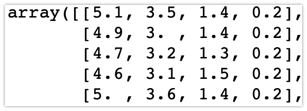
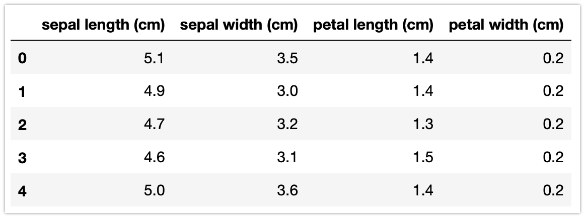
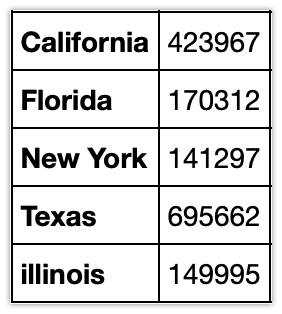
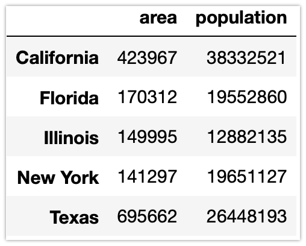
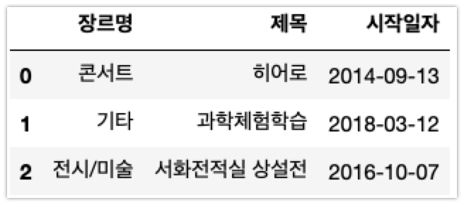
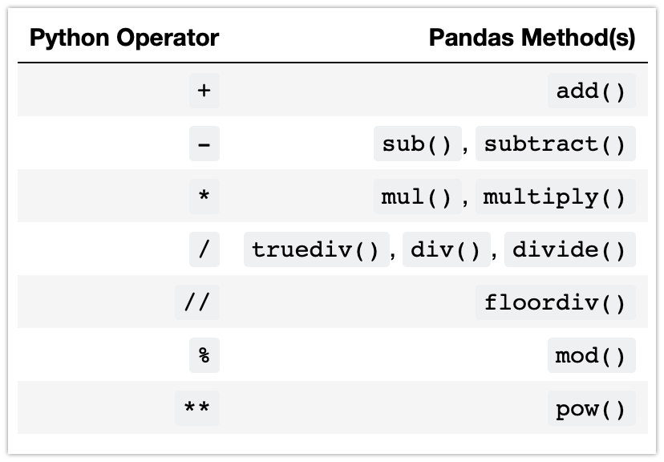
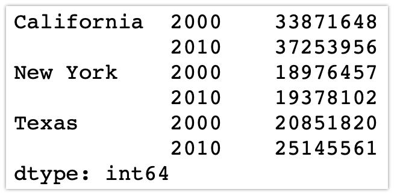
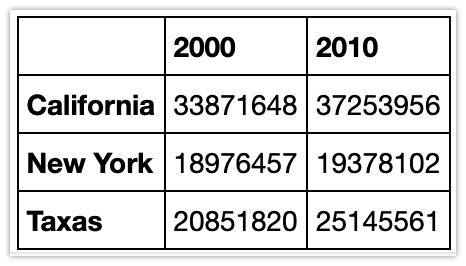
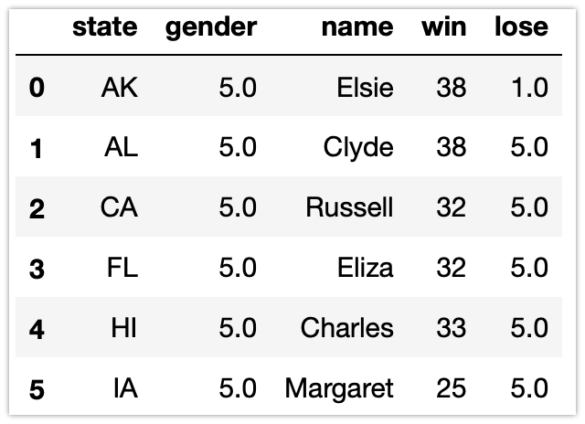
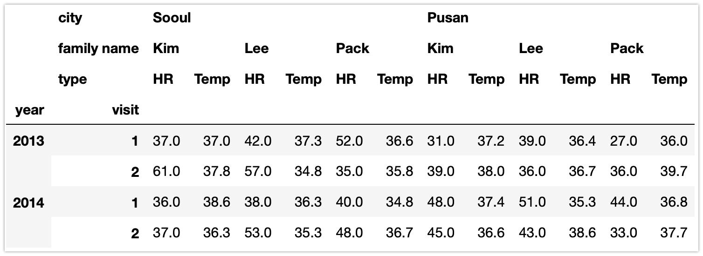

# Pandas으로 데이터 가공하기

NumPy를 활용하여 복잡한 데이터 배열(n 차원)을 저장하고 가공할 수 있었다. Pandas는 NumPy를 기반으로 만들어진 새로운 패키지로서 DataFrame이라는 효율적인 자료구조를 제공한다.

- NumPy의 배열

```python
from sklearn import datasets
import pandas as pd

iris = datasets.load_iris()
ar = iris.data
```



- DataFrame : 근본적으로 행과 열 레이블이 부착된 다차원 배열, 여러가지 타입의 데이터를 저장할 수 있으며 데이터 누락도 혀용, 데이터베이스와 스프레드시트 프로그램과 유사

```python

df = pd.DataFrame(iris.data, columns = iris.feature_names)
df.head()
```




## Pandas 설치 및 사용

시스템에 Pandas를 설치하려면 먼저 NumPy가 설치되어 있어야한다. 일반적으로 NumPy를 np라는 별명으로 임포트 하는 것처럼 Pandas도 pd라는 별명으로 임포트하자

```python
import pandas as pd
```

 Pandas는 NumPy의 데이터를 다양한 형태의 객체(Series, DataFrame, Index)로 구조화하여 여러 유용한 도구와 메서드, 기능을 제공하는 역할을 한다.


## Series : 다양한 종류의 인덱스를 가진 NumPy 배열

Series 객체는 기본적으로 1차원 NumPy 배열과 비슷해 보이지만 차이는 인덱스에 있다. NumPy 배열에는 값에 접근하는데 사용되는 (암묵적인, 지정하지 않아도 자동으로 설정되는) 정수형 인덱스가 있고, **Pandas의 Series에는 객체 생성 시 명시적으로 인덱스를 지정**할 수 있다.

```python
data = pd.Series([0.25, 0.5, 0.75, 1.0])
data
```

Series에서 values와 index 속성으로 데이터와 인덱스를 접근할 수 있다.

```python
data.values
data.index
```

별도로 인덱스를 지정하지 않으면 정수형 인덱스가 설정된다.

```python
data[1]
data[1:3]	
```

인덱스를 명시적으로 지정하자. 명시적으로 지정되는 인덱스는 숫자나 문자열이 될수도 있다. 데이터 부분([0.25, 0.5, 0.75, 1.0])다음에 index 속성으로 인덱스 배열([2, 5, 3, 7])을 지정하자. 

```python
data = pd.Series([0.25, 0.5, 0.75, 1.0],
                 index=[2, 5, 3, 7])
data[5]

data = pd.Series([0.25, 0.5, 0.75, 1.0],
                 index=['a', 'b', 'c', 'd'])
data['b']
```


## 딕셔너리로 Series 만들기

딕셔너리를 활용하면 인덱스와 값을 분명하게 구분하여 Series를 생성할 수 있다. 다음과 같은 딕셔너리를 만들자

```python
population_dict = {'California': 38332521,
                   'Texas': 26448193,
                   'New York': 19651127,
                   'Florida': 19552860,
                   'Illinois': 12882135}
```

딕셔너리의 키(California, Texas, …)는 인덱스가 되고 해당하는 값들은 데이터가 된다. 다음과 같이 Series 객체를 만들자

```python
population = pd.Series(population_dict)
population
```

딕셔너리의 키가 시리즈의 인덱스가 되어 접근하거나 슬라이스를 할 수 있다.

```python
population['California']
population['California':'Illinois']
```


### 예제 ) 다음의 데이터로 area라는 Series 객체를 만드세요.




## DataFrame : 여러 Series가 모인 2차원의 배열

Series가 유연한 인덱스의 1차원 배열이라면 DataFrame은 유연한 행 인덱스와 열을 가진 2차원배열이라고 볼 수 있다. 즉 DataFrame은 여러 Series객체의 연속이다. 

앞에서 구성했던 population, area  Series객체를 합쳐 DataFrame 객체를 구성하자. 딕셔너리의 형태로 키는 열의 이름 값은 Series 객체가 들어간다.

```python
states = pd.DataFrame({'population': population,
                       'area': area})
states
```



Series  객체와 마찬가지로 DataFrame도 인덱스를 접근할 수 있는 index 속성이 있다. 또한 열의 이름을 모아놓은 column 속성을 가지고 있다.

```python
states.index
states.columns
```

딕셔너리는 키를 값에 매핑한다면 DataFrame은 열이름을 Series에 매핑한다.

```python
states['area']
```

2차원의 NumPy 배열에는 data[0]이 첫 **행**을 의미하지만 DataFrame의 경우에는 data['컬럼이름']이 **열**을 의미함에 주의하자


## DataFrame 객체를 구성하는 다양한 방법

### Series로 구성하기

```python
pd.DataFrame(population, columns=['population'])
```

### 리스트 안의 딕셔너리로 구성하기

```python
data = [{'a': i, 'b': 2 * i}
        for i in range(3)]
print(data)
pd.DataFrame(data)
```

리스트 안 딕셔너리의 키는 행이 된다. 또한 각 요소인 딕셔너리의 키가 다르더라도(누락되더라도) 누락된 자리를 NaN(Not a Number) 값으로 채운다. 

```python
pd.DataFrame([{'a': 1, 'b': 2}, {'b': 3, 'c': 4}])
```

### 배열로 구성하기

```python
A = np.array([1,2,3,4,5,6], dtype={'names':('a','b'), 'formats' : ('int', 'float')})
A
pd.DataFrame(A)
```


### 예제) 다음 형태의 DataFrame을 만드세요.




## Index 객체

Series와 DataFrame 객체가 데이터를 참조하고 수정하게 해주는 명시적인 인덱스를 포함한다. 각 객체에서 Index 부분만 별도로 떼어보면 배열과 같지만 몇가지 특징이 있다.

```python
pd.DataFrame({'population': population,
              'area': area}).index
```

배열로 인덱스 값을 얻어오므로 파이썬에서 처럼 정수나 슬라이스를 활용하여 특정 부분의 인덱스 값만 가져올 수 있다.

```python
ind = pd.Index([2, 3, 4, 5, 11])
ind

ind[1] # 2번째를 의미하는 정수로
ind[::2] # 슬라이스
```

다만 변경할 수 없다. 인덱스가 변경되면 그에 매칭되는 데이터를 제대로 참조할 수 없기 때문

```python
try:
	ind[1] = 0
except TypeError as e:
  print(e)
```


# 데이터 인덱싱과 선택

## Series에서 데이터 선택

Series는 딕셔너리, 배열처럼 슬라이스, 마스킹, 팬시 인덱싱등 다양한 방식으로 값을 선택할 수 있다. 

```python
import pandas as pd
data = pd.Series([0.25, 0.5, 0.75, 1.0],
                 index=['a', 'b', 'c', 'd'])
data

data['a':'c'] # 선언에서 지정한(명시적인) 인덱스로 슬라이싱

data[0:2] # 자동으로 지정된(묵시적인) 인덱스로 슬라이싱

data[(data > 0.3) & (data < 0.8)] # 마스킹

data[['a', 'e']] # 펜시 인덱싱
```

선언에서 지정한 명시적 인덱스로 슬라이싱 할때는 마지막값이 포함이지만 자동으로 숫자로 지정된 암묵적 인덱스에서는 최종 인덱스 값이 슬라이스에서 제외된다는 점에 주의하자.


## 인덱서 : loc, iloc 

 앞의 예시에서 명시적으로 정수 인덱스를 선언하였다면, 슬라이싱을 할 때 혼동을 불러 일으킬 수 있다. 가령 Series가 다음 코드처럼 명시적인 정수 인덱스를 가지고 있다.

```python
data = pd.Series(['a', 'b', 'c'], index=[1, 3, 5])
data

data[1] # 인덱스로 가져올 때는 명시적인 형식으로 인덱스 사용

data[1:3] # 슬라이싱할 때는 암묵적인 형태로 인덱스 사용 
```

정수형태의 인덱스를 사용할 경우 혼선이 발생할 수 있기 때문에 Pandas는 특정 인덱싱 방식을 활용할 것인지 지정하는 **인덱서**(Indexer)를 제공한다.


loc 인덱서는 **명시적인 인덱스 형태로 참조**하는 방식이다.

```python
data.loc[1]

data.loc[1:3]
```


iloc 인덱서는 파이썬 스타일(0~N)의 **암묵적인 행태**로 참조하는 방식이다.

```python
data.iloc[1]

data.iloc[1]
```


## DataFrame에서 데이터 선택

DataFrame의 열을 이루는 각 Series는 열 이름으로 된 딕셔너리 스타일(중괄호를 사용하는 형태)의 인덱싱을 통해 접근할 수 있다.

```python
area = pd.Series({'California': 423967, 'Texas': 695662,
                  'New York': 141297, 'Florida': 170312,
                  'Illinois': 149995})
pop = pd.Series({'California': 38332521, 'Texas': 26448193,
                 'New York': 19651127, 'Florida': 19552860,
                 'Illinois': 12882135})
data = pd.DataFrame({'area':area, 'pop':pop})
data

data['area']
```

DataFrame의 형을 참조하여 객체의 내용을 변경하거나 새로운 열을 추가할 때도 사용한다.

```python
data['density'] = data['pop'] / data['area']
data
```

## DataFrame에서 인덱서 활용

loc과 iloc 인덱서를 활용하면 중괄호 안에 행과 열로 구분하여 슬라이싱을 진행할 수 있다.

```python
data.iloc[:3, :2]

data.loc[:'Illinois', :'pop']
```

두 인덱서를 조합하여 ix 인덱서를 활용할 수 있지만 정수형태의 인덱스일 경우 앞에서 논의 했던것과 같은 혼동의 가능성이 있음을 주의하자.

```python
data.ix[:3, :'pop']
```

인덱서와 마스킹, 펜시인덱싱을 경합하면 다음과 같이 활용할 수 있다.

```python
data.loc[data['density'] > 100, ['pop', 'density']] # 밀도(density)가 100 이상인 행에서 pop, density 열을 참조
```

DataFrame의 값을 변경

```python
data.iloc[0, 2] = 90 # DataFrame에서 0행 2열의 값을 90으로 수정
data
```

## 

## Pandas에서 데이터 연산하기

Pandas의 Series, DataFrame에  NumPy의 유니버설 함수를 적용하면 결과물에 인덱스 열 이름을 보존할 수 있고, 정렬해주는 효과가 있다. 따라서 데이터의 맥락이 유지되고 다른 데이터셋에서 가져온 데이터를 결합하는 작업을 수월하게 진행할 수 있다.

### 인덱스의 보존

예시를 위해 Series와 DataFrame을 생성하자.

```python
rng = np.random.RandomState(42)
df = pd.DataFrame(rng.randint(0, 10, (3, 4)),
                  columns=['A', 'B', 'C', 'D'])
df
```

NumPy의 유니버설 함수를 적용하면 그 결과에 인덱스가 그대로 보존되어 나타난다.

```python
np.sin(df)
```

### 인덱스 정렬

서로 다른 Series 또는 DataFrame객체에 이항 연산을 적용하는 경우 Pandas는 연산을 수행하는 과정에서 두 인덱스를 정렬한다. 

앞에서 작성한 Series에서 면적기준 상위 3개주 인구 기준 상위 3개 주를 추렸다.

```python
area = pd.Series({'California': 423967, 'Texas': 695662,
                  'Alaska' : 1723337}, name='area')
population = pd.Series({'California': 38332521, 'Texas': 26448193,
                 'New York': 19651127}, name='population')
```

두 데이터를 나누어 인구 밀도를 계산하면?

```python
population / area
```

결과로 두 배열의 인덱스의 합집합으로 연산한 결과가 정렬되어 나타난다. 아래의 예시도 마찬가지다.

```python
A = pd.Series([2, 4, 6], index=[0, 1, 2])
B = pd.Series([1, 3, 5], index=[1, 2, 3])
A + B
```

인덱스와 마찬가지로 열에서도 정렬되어 나타나는 것을 확인할 수 있다. 다음과 같이 두 개의 데이터프레임이 있다고 할 때  열의 이름에 주목하자.

```python
A = pd.DataFrame(rng.randint(0, 20, (2, 2)),
                 columns=list('AB'))
A

B = pd.DataFrame(rng.randint(0, 10, (3, 3)),
                 columns=list('BAC'))
B

A + B
```

앞의 예시에 나온 연산 외에 다양한 형태의 함수들이 있으므로 활용하자.



### DataFrame과 Series간의 연산

DataFrame과 Series사이에서 연산할 때 인덱스와 열의 순서는 유지된다.

```python
A = rng.randint(10, size=(3, 4))
A

df = pd.DataFrame(A, columns=list('QRST'))
df - df.iloc[0] # 첫 행으로 각 열의 값을 뺀다.
```


# DataFrame을 CSV 파일로 내보내고 읽어오기

실습의 편의를 위해 갯수가 많은 데이터들은 CSV 파일로 데이터를 내보내거나 읽어오자.

## 내보내기

데이터프레임에서 to_csv("파일경로/파일이름.csv") 함수로 작성한 내용을 csv 파일로 저장할 수 있다. 파일이름을 입력할 때 확장명(.csv)를 생략하지 않는다. 작성하는 ipynb 파일과 csv 파일(export2.csv)이 모여있는 data 폴더가 같이 있다면 이렇게 쓸수 있다.

```python
df.to_csv('./data/export2.csv')
```

## 읽어오기

csv 파일에서 저장한 데이터를 데이터프레임으로 읽어오려면 read_csv('파일경로\파일이름.csv', index_col=0)함수를 활용, (index_col = 0은 0번째 행을 인덱스로 활용한다는 의미이다.) 작성하는 ipynb 파일과 csv 파일이 모여있는 data 폴더가 같이 있다면 이렇게 쓸수 있다.

```
df_read = pd.read_csv('./data/export2.csv', index_col=0)
df_read
```


# 누락된 데이터 처리하기

현실의 데이터는 깨끗하거나 형태가 단일한 경우가 드물다. 이 절에서는 누락된 데이터에 대해 일반적으로 고려할 사항을 논의하고 이를 대처하는 방안에 대해 알아본다. 여기서는 누락된데이터를 null, NaN, NA값으로 나타낸다. 누락된 데이터를 표시하기 위한 다양한 방식중 몇가지를 소개한다.

- 1비트를 누락 전용 표기로 활용 (**1**0000, **0**1010, **0**1111, **0**1001)

- 데이터의 특징상 나올 수 없는 값 ( 가격. 객수의 경우 -1, -9999)

- NaN(Not a Number)로 표시

- NA(Nat Available) : 값이 결손(손상)됨, Pandas는 미지원 NaN으로 표시

- Null : 값이 존재하지 않는다. 손상되어 쓸 수 없는 경우도 포함
- None : 파이썬의 누락된 데이터, NaN으로 자동 변환된다.


## NaN : 누락된 숫자 데이터

NaN은 표준 IEEE 부동 소수점 표기를 사용하는 모든 시스템에 적용된 특수 부동 수수점 값이다. 다음 배열에서 데이터 타입에 주목하자.

```python
vals2 = np.array([1, np.nan, 3, 4]) 
vals2.dtype
```

정수 배열의 값에서 NaN이 있다면 자동으로 부동 소수점 타입으로 변환된다

연산을 할 때, 어떤 연산이든 관계없이 NaN이 포함된 산술 연산의 결과는 NaN이 된다.

```
1 + np.nan

vals2.sum(), vals2.min(), vals2.max()
```

NaN 값을 무시하는 연산이 제공되니 참고하자.

```
np.nansum(vals2), np.nanmin(vals2), np.nanmax(vals2)
```


## 널 값 연산하기

Pandas는 None과 NaN을 근본적으로 누락된 값이나 널 값을 가리키기 위해 처리한다.

### 널 값 감지

널 데이터 감지를 위한 메서드로 isnull()과 notnull()의 두가지가 있다. 둘 다 데이터에 대한 부을 마스크를 반환한다.

```python
data = pd.Series([1, np.nan, 'hello', None])
data.isnull()
```

isnull()은 NaN 값을 만나면 True, 아니면 False로 부울배열을 생성하고, notnull()은 NaN 값을 만나면 False, 아니면 True로 부울 배열을 만든다. 


### 예제) 다음 Series에서 null 값을 추린 새로운 Series를 만드세요.

```python
data = pd.Series([1,5,3,np.nan,8,4,6,1,
                  np.nan,12,19,np.nan,28,155,np.nan,1,
                  44,15,87,np.nan,124,92,np.nan, np.nan])
```


### 널 값 제거하기

부울 행렬을 활용하는 것 이외에 값을 구조상에서 제거하는 dropna() 메서드와 다른 값으로 채우는 fillna()메서드가 있다. 

```python
data = pd.Series([1, np.nan, 'hello', None]) # 앞의 예제와 동일
data.dropna()
```

DataFrame에서는 단일 값만 삭제할 수 없으며, NaN이 있는 전체 행이나 열을 삭제하는 것이 가능하다.

```python
df = pd.DataFrame([[1,      np.nan, 2],
                   [2,      3,      5],
                   [np.nan, 4,      6]])
df
```

축에 따라 NaN 값을 삭제

```python
df.dropna()

df.dropna(axis='columns') # 열을 기준으로 NaN 이 있는 열은 제거, 'columns' 대신 1 입력가능
df.dropna(axis='rows') # 행을 기준으로 NaN이 있는 행을 제거, 'rows' 대신 0 입력가능
```

일부 유효한 데이터도 삭제되므로 how나 thresh 키워드로 제거하는 널 값을 조절 할 수 있다.

how는 any나 all로 설정한다. 기본값인 any는 행이나 열에 NaN이 하나라도 있다면 해당 행이나 열은 모두 삭제한다.

all은 행이나 열의 모든 값이 NaN일 경우에만 삭제한다.

```python
df[3] = np.nan # 3이라는 열이름으로 NaN 값을 채운다.
df

df.dropna(axis='columns', how='all')
```

thresh는 행이나 열에서 널 값이 아닌 값이 최소 몇개인지 지정한다. 즉 설정한 값보다 유효데이터의 갯수가 적다면 해당 행과 열을 삭제한다.

```python
df.dropna(axis='rows', thresh=3)
```


### 널 값 채우기

NaN 값을 삭제하지 않고 유효한 값으로 대체하는 방법이다. Isnull() 메서드를 마스크로 활용할 수 있지만 Pandas는 널 값을 대체한 배열의 사본을 반환하는 fillna() 메서드를 제공한다.

```python
data = pd.Series([1, np.nan, 2, None, 3], index=list('abcde'))
data

data.fillna(0) # nan 값을 0으로 대체한다.
```

값을 지정하는 대신에 이전 순서의 값 혹은 뒤의 순서의 값으로 지정할 수 있는 method 속성이 있다.

이전값으로 체울려면 method 값을 ffill로, 뒤의 값으로 채울려면 method 값을 bfill로 설정한다.

```python
# forward-fill(이전 값으로 채우기)
data.fillna(method='ffill')

# back-fill (다음에 오는 값으로 채우기)
data.fillna(method='bfill')
```

axis 옵션으로 적용할 기준(행 or 열)을 선택할 수 있다.

```python
df.fillna(method='ffill', axis=1) # NaN이 있다면 앞열의 값을 가져온다.
```

### 예제) 다음과 같은 전적 데이터(./data/score.csv)가 있을 때 성별을 알 수 없는 데이터는 제거하고 패를 알 수 없는 데이터는 0에서 10 사이의 임의의 숫자를 하나 선택해 수정하세요 

```
quiz_load = pd.read_csv('./data/score.csv', index_col=0)
quiz_load

# np.random.randint(0,10)
```




# 계층적 인덱싱

단일 인덱스 내에 여러 인덱스 레벨을 포함하는 계층적 인덱싱, 혹은 다중인덱싱을 구성할 수 있다. 이 방식을 활용하면 고차원의 데이터를 1차원의 Series와 2차원의 DataFrame객체로 간결하게 표현할 수 있다.


## 다중 인덱스된 Series

두 연도(2000, 2010)에 대해 미국주의 데이터를 표현한다고 가정하자. 이 데이터프레임을 1차원 Series로 표현한다면?



```python
index = [('California', 2000), ('California', 2010),
         ('New York', 2000), ('New York', 2010),
         ('Texas', 2000), ('Texas', 2010)]
populations = [33871648, 37253956,
               18976457, 19378102,
               20851820, 25145561]
pop = pd.Series(populations, index=index)
pop
```

파이썬의 튜플을 키값으로 사용하였다. 이 방식을 사용하면 간단하게 이 다중 인덱스를 기반으로 시리즈를 인덱싱하거나 슬라이싱 할 수 있다.

```python
pop[('California', 2010):('Texas', 2000)]
```

다만 일부 값(2010)년의 모든 값을 선택해야 한다면 다소 불편한 작업을 해야한다.

```python
pop[[i for i in pop.index if i[1] == 2010]]
```


## Pandas의 MultiIndex

앞에서는 튜플을 기반으로 한 기초적인 다중 인덱스이고, Pandas는 MultiIndex으로 더 나은 방식을 제공한다. 다음과 같이 튜플로부터 다중 인덱스를 생성할 수 있다.

```python
index = [('California', 2000), ('California', 2010),
         ('New York', 2000), ('New York', 2010),
         ('Texas', 2000), ('Texas', 2010)] # 앞에서 만든 튜플

index = pd.MultiIndex.from_tuples(index) # 튜플로 다중 인덱스를 만듬
index
```

- levels : 각 레벨에서 사용할 수 있는 인덱스 값을 담은 리스트
- labels : 레이블을 참조하는 리스트


새로 만든 인덱스를 데이터에 reindex() 메소드로 적용하자.

```python
pop = pop.reindex(index)
pop
```




앞의 예제처럼 2010년의 데이터에 접근하려면 간단히 슬라이싱을 표기하면 된다. 콤마(,)를 기준으로 앞 level의 인덱스(California, New York, Texas)와 뒤 level의 인덱스(2000, 2010)을 구분하여 표기한다.

```python
pop[:, 2010]
```

unstack() 메서드를 활용하면 MultiIndex로 구성된 Series를 일반적인 인덱스를 가진 DataFrame로 간단히 변환할 수 있다.

```python
pop_df = pop.unstack()
pop_df
```

이와 반대로 stack() 메서드는 DataFrame을 MultiIndex로 구성된 Series로 구성할 수 있다.

```python
pop_df.stack()
```

다중 인덱스에서 각 추가 레벨은 데이터의 추가적 차원(범주)로 표현한다. 이 방식을 활용하면 표현할 수 있는 데이터 유형에 더 많은 유연성을 제공한다. 앞에서 만든 MultiIndex로 만든 Series(pop)에 새로운 열을 추가해보자

```python
pop_df = pd.DataFrame({'total': pop,
                       'under18': [9267089, 9284094,
                                   4687374, 4318033,
                                   5906301, 6879014]})
pop_df
```

새로운 데이터가 추가된 DataFrame에 유니버설 함수를 적용해도 잘 적용되는 것을 확인할 수 있으며, 아래는 연도별로 18세 이하의 인구비율을 계산한다.

```python
f_u18 = pop_df['under18'] / pop_df['total']
f_u18.unstack()
```


## MultiIndex 생성 방법

가장 간단하게 DataFrame을 생성할 때 Index 배열리스트로 설정한다.

```python
df = pd.DataFrame(np.random.rand(4, 2),
                  index=[['a', 'a', 'b', 'b'], [1, 2, 1, 2]],
                  columns=['data1', 'data2'])
df
```

직접 MultiIndex를 만드는 pd.MultiIndex 클래스 메서드 생성자를 사용하면 조금 더 간단하게 만들 수 있다.

### 배열로 만들기

```python
pd.MultiIndex.from_arrays([['a', 'a', 'b', 'b'], [1, 2, 1, 2]])
```

### 리스트 안의 튜플로 만들기

```python
pd.MultiIndex.from_tuples([('a', 1), ('a', 2), ('b', 1), ('b', 2)])
```

### 데카르트 곱으로 만들기

```python
pd.MultiIndex.from_product([['a', 'b'], [1, 2]])
```

### 직접 Levels과 labels를 입력하여 만들기

```python
pd.MultiIndex(levels=[['a', 'b'], [1, 2]],
              labels=[[0, 0, 1, 1], [0, 1, 0, 1]])
```


## MultiIndex의 레벨 이름

MultiIndex 생성자에 names 인수를 전달하거나 names 속성을 설정하면 각 레벨에 이름을 지정할 수 있다. 이는 인덱스의 의미를 파악하는데 유용할 수 있다.

```
pop.index.names = ['state', 'year']
pop
```


## 열에 적용된 MultiIndex

DataFrame에서 행과 열은 대칭적이며, 행에서는 인덱스가 여러 레벨로 구분되듯이 열도 여러 레벨로 구성할 수 있다.

두개의 MultiIndex를 구성하자

```python
# 계층적 인덱스와 열
index = pd.MultiIndex.from_product([[2013, 2014], [1, 2]],
                                   names=['year', 'visit'])
columns = pd.MultiIndex.from_product([['Bob', 'Guido', 'Sue'], ['HR', 'Temp']],
                                     names=['subject', 'type'])
```

가상의 데이터를 만드는 부분이다.

```python
# 일부 데이터 모형 만들기
data = np.round(np.random.randn(4, 6), 1)
data[:, ::2] *= 10
data += 37
```

DataFrame을 생성할 때, 행(index)과 열(column)에 아까 만든 MultiIndex를 넣어준다.

```python
# DataFrame 생성하기
health_data = pd.DataFrame(data, index=index, columns=columns)
health_data
```

열의 인덱스로 사람이름을 지정하였는데 이를 활용하면 다음과 같이 특정 사람의 정보를 편리하게 모두 가져올 수 있다.

```python
health_data['Guido']
```

###  

### 예제) 위의 DataFrame 행을 다음과 같이 새로 작성하자.

데이터는 다음과 같이 만들자.

```python
# 일부 데이터 모형 만들기
data = np.round(np.random.randn(4, 12), 1)
data[:, ::2] *= 10
data += 37
```

 


## MultiIndex 인덱싱 및 슬라이싱

### MultiIndex가 적용된 Series

앞에서 본 다중 인덱스의 Series를 활용하자. 인덱스의 Level을 입력하여 요소에 접근할 수 있다.

```python
pop

pop['California', 2000]

pop['California']

pop[:, 2000] # 첫 인덱스를 빈 슬라이스로 전달하고 낮은 레벨에서 부분 인덱싱
```

인덱스가 정렬되어 있다면 부분 슬라이싱도 가능하다.

```python
pop.loc['California':'New York']
```

부을 마스크를 만들어 적용할 수도 있다.

```python
pop[pop > 22000000]
```

펜시 인덱싱을 활용한 예시

```python
pop[['California', 'Texas']]
```


### MultiIndex가 적용된 DataFrame

앞에서 만든 DataFrame을 활용하자

```python
health_data
```

Series에서 사용한 것처럼 DataFrame도 열을 기본으로 적용된다.

```
health_data['Guido', 'HR']
```

행과 열에 모두 인덱싱을 적용하려면 loc, iloc, ix 인덱서를 활용하면 된다. 중괄호에서 콤마를 기준으로 앞은 행에 대한 슬라이스, 뒤는 열에 대한 슬라이스를 의미한다.

```python
health_data.iloc[:2, :2]
```

개별 인덱스를 튜플로 전달될 수 있다.

```
health_data.loc[:, [('Guido', 'Temp'),('Bob', 'Temp')]]
```


# 다중 인덱스 재정렬하기

MultiIndex 슬라이싱 연산은 인덱스가 정렬되어 있어야 한다. 다음과 같은 데이터를 만들어 보자.

```python
index = pd.MultiIndex.from_product([['a', 'c', 'b'], [1, 2]])
data = pd.Series(np.random.rand(6), index=index)
data.index.names = ['char', 'int']
data
```

이 Series의 인덱스를 슬라이싱하려고 하면 오류가 발생한다.

```python
try:
    data['a':'b']
except KeyError as e:
    print(type(e))
    print(e)
```

슬라이스와 다른 연산을 수행하려면 MultiIndex의 레벨이 (사전의 순서대로) 정렬된 순서로 배열되어야 한다. 이때 sort_index() 메서드를 활용한다.

```java
data = data.sort_index()
data
```

다시 앞의 코드를 실행해보자

```python
try:
    data['a':'b']
except KeyError as e:
    print(type(e))
    print(e)
```


### 인덱스 설정 및 재설정

인덱스에 있던 정보를 그대로 열로 만드는 reset_index() 메서드가 있다. 

```python
pop_flat = pop.reset_index(name='population')
pop_flat
```

반대로 열 값으로부터 set_index() 메서드로 MultiIndex를 만들 수도 있다. 

```python
pop_flat.set_index(['state', 'year'])
```


# 다중 인덱스에서 데이터 집계

DataFrame에서 mean(), sum(), max() 등을 활용하여 집계한 것처럼 다중 인덱스에서 데이터 집계를 할 수 있다. 앞에서 다른 데이터를 활용하자.

```python
health_data
```

집계 연산을 적용하고자 하는 인덱스의 레벨 이름을 지정하여 연산을 할 수 있다.

```python
data_mean = health_data.mean(level='year')
data_mean
```

추가하여 axis 키워드를 활용해 열의 레벨로 연산도 할 수 있다.

```python
data_mean.mean(axis=1, level='type')
```

