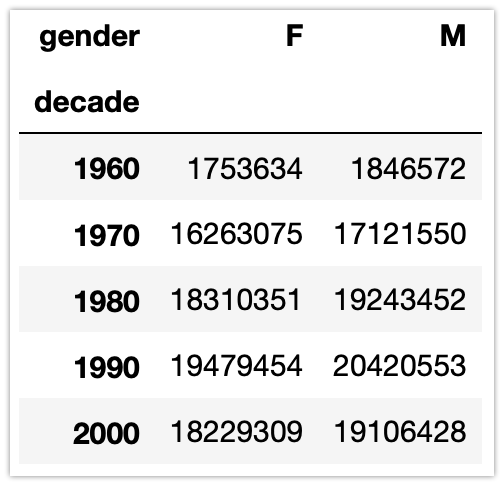

# 피벗 테이블

피벗테이블(pivot table)은 표 형태의 데이터로 작업하는 스프레드시트와 다른 프로그램에서 일반적으로 볼 수 있는 작업이다. 입력값으로 간단한 열 단위의 데이터를 취하고 그 데이터에 대한 다차원 요약을 제공하는 테이블을 구성한다.

Seaborn 라이브러리에 내장된 데이터를 사용하자.

```
import numpy as np
import pandas as pd
import seaborn as sns
titanic = sns.load_dataset('titanic')
titanic.head()
```


### 예제)

groupby를 활용하여 성별에 따른 평균 생존률을 구하세요. 조금 더 심화하여 성별과 좌석 등급별 생존율을 보고 싶다면?


## 피벗 테이블 구문

```python
titanic.pivot_table('survived', index='sex', columns='class')
```

피벗테이블은 pivot_table() 메서드를 사용해 만들 수 있으며, 첫 인수에는 계산할 데이터의 열 이름을 준다. index 와 columns는 피벗테이블에서 구분할 그룹(sex, class)을 의미하는 열이름을 넣는다.


### 다단계 피벗 테이블

피벗테이블은 여러가지 옵션을 활용하여 데이터의 구간을 만들어 활용할 수 있다. 다음은 pd.cut() 함수를 사용하여 연령별로 구간을 만든 예시이다.

```python
age = pd.cut(titanic['age'], [0, 18, 80])
```

 pd.cut() 함수는 주어진 데이터를 자를 구간의 구분값(경계값)으로 나눈다. 위에서는 (0~18, 18~80)의 2구간으로 나누어 데이터를 구분해준다.

```python
titanic.pivot_table('survived', index=['sex', age], columns='class')
```

다음은 지불한 비용(fare)에 따라서도 분석해보자. 여기서는 pd.qcut() 함수를 활용한다.

```python
fare = pd.qcut(titanic['fare'], 2)
```

pd.qcut() 함수는 주어진 데이터를 N 개의 파트로 구분한다. 위의 코드에서는 운임을 2개의 파트로 구분하여 활용한다,

```python
titanic.pivot_table('survived', index=['sex', age], columns=[fare, 'class'])
```

### 

### 기타 피벗 테이블 옵션

```python
# Pandas 0.19 버전 기준 호출 시그니처
DataFrame.pivot_table(data, values=None, index=None, columns=None,
                      aggfunc='mean', fill_value=None, margins=False,
                      dropna=True, margins_name='All')
```

- fill_value : 누락된 값 채우기

- dropna : 누락된 값 지우기

- aggfunc : 집계에 사용할 연산을 지정(기본값으로는 평균이다, sum, mean, count, min, max 등을 쓸 수 있음)

  - 원하는 열을 다른 집계로 매핑한 딕셔너리를 지정할 수 도 있다.

  - ```python
    titanic.pivot_table(index='sex', columns='class',
                        aggfunc={'survived':sum, 'fare':'mean'})
    ```

- margins : 그룹별 총합을 계산

- margin_name : 홍합을 구한 열과 행의 이름을 지정한다.

  ```python
  titanic.pivot_table('survived', index='sex', columns='class', margins=True)
  ```


### 예제) 

다음과 같이 연대별 남녀 출생수를 구해보자. 데이터셋은 birth.csv 파일을 활용하자.




# Matplotlib을 활용한 시각화

파이썬의 시각화도구인 Matplotlib를 알아보자 Matplotlib의 가장 중요한 특징 중 하나는 다양한 운영체제와 그래픽 표현이 필요한 시스템에서 잘 동작한다는 점이다. 따라서 사용하는 운영체제가 무엇이든 이 패키지를 통해 시각화 작업을 진행할 수 있다. 


## 일반적인 Matlotlib 사용법

Matplotlib를 임포트할 때에도 약어를 사용하여 임포트한다. 이후 진행을 위해 numpy와 pandas도 같이 임포트하자.

```python
import matplotlib.pyplot as plt
import numpy as np
import pandas as pd
```

다음 코드는 임의의 데이터를 구성하고 sin, cos곡선을 그린 예시이다. 한번 실행해보자.

```python
x = np.linspace(0, 10, 100)

fig = plt.figure()
plt.plot(x, np.sin(x), '-')
plt.plot(x, np.cos(x), '--');
```


## 그림을 파일로 저장하기

Matplotlib의 좋은점은 다양한 형태의 그래프를 그림파일로 저장할 수 있다는 점이다. savefig() 명령어를 사용하여 그림을 저장할 수 있다. 예시에는 png 파일로 그림을 저장하지만 다른 그림파일로도 저장할 수 있다. 

```
fig.savefig('my_figure.png')
```

지원하는 그림파일의 타입은 다음과 같다.


저장한 그림파일을 표시하려면 IPython Image 객체를 사용해 표시할 수 있다.

```python
from IPython.display import Image
Image('my_figure.png')
```


## 플롯의 구성

Matplotlib를 통해 플롯(그래프)를 그리는 것은 그림(figure)와 축(axes)를 만드는 것으로 시작

- 그림(figure) : 축, 그래픽, 텍스트, 레이블을 표시하는 하나의 컨테이너(ex) 그림이 그려지는 종이)
- 축(axes) : 하나의 플롯 그래프( 영어에서 축을 의미하는 axis의 복수가 axes, 철자에 주의하자)
- axis : x축, y축을 의미


## 플롯을 그리는 2가지 방법

Matplotlib은 매트랩(Matlab) 프로그램 사용자를 위한 매트랩 스타일의 인터페이스와 다양한 플롯을 그리는데 편리한 객체지향 인터페이스를 제공한다.


### 매트랩 스타일의 인터페이스

```python
plt.figure()  # 플롯 그림을 생성

# 두 개의 패널 중 첫 번째 패널을 생성하고 현재 축(axis)을 설정함
plt.subplot(2, 1, 1) # (rows, columns, panel number)
plt.plot(x, np.sin(x))

# 두 번째 패널을 생성하고 현재 축(axis)을 설정함
plt.subplot(2, 1, 2)
plt.plot(x, np.cos(x));
```


### 객체지향 인터페이스

```python
# 먼저 플롯 그리드를 생성함
# ax는 두 개의 축 객체의 배열이 됨
fig, ax = plt.subplots(2)

# 적절한 객체의 plot() 메소드를 호출함
ax[0].plot(x, np.sin(x))
ax[1].plot(x, np.cos(x));
```


# 라인 플롯 (Line Plot)

라인플롯은  x, y의 값을 선으로 표현한 플롯이다. 플롯을 그리기 전에 figure와 axes 를 만들어보자.

```
plt.style.use('seaborn-whitegrid') # 플롯에 스타일을 주기 위한 코드

fig = plt.figure()
ax = plt.axes()
```

축을 만들고 나면 ax.plot() 함수를 활용해 x축 데이터, y축 데이터를 입력한다. 여기서는 간단한 사인 곡선으로 작성하자.

```python
x = np.linspace(0, 10, 1000)
ax.plot(x, np.sin(x));
```

다른 방법으로 Matplotlib 안의 pyplot 모듈을 활용하면 같은 그림을 간단하게 그릴 수 있다.

```python
plt.plot(x, np.sin(x));
```

여러개의 선을 가진 그림 하나를 만들고 싶다면 plot 함수를 여러번 호출하기만 하면 된다.

```
plt.plot(x, np.sin(x))
plt.plot(x, np.cos(x));
```

# 

## 플롯 수정하기 : 색상과 스타일

플롯에서 선의 생상과 스타일을 수정하려면 plt.plot() 함수에서 추가 인수를 받는다. 색상은 color 키워드를 사용한다. 아무 색도 지정하지 않으면 자동으로 기본 색상이 적용된다.

```python
plt.plot(x, np.sin(x-0), color='blue') # 색이름
plt.plot(x, np.sin(x-1), color='g') # 색이름 축약(단일문자 표현)
plt.plot(x, np.sin(x-2), color='0.75') # 회색조(0~1)
plt.plot(x, np.sin(x-3), color='#FFDD44') # RGB 코드(RRGGBB, 16진수)
plt.plot(x, np.sin(x-4), color=(0,0,1))#RGBA 코드(0~1)
```

- RGBA 색상 예시

  (0,0,0) > 흰색 (1,1,1) > 검정 (1,0,0) > 빨강 (1,0,0,1) > 빨강 (마지막 숫자는 투명도)

- 색상 볼수 있는 사이트 링크 : https://www.w3schools.com/colors/colors_names.asp


다음은 linestyle 키워드를 활용한 선 스타일이다.

```python
plt.plot(x, x+0, linestyle='solid')
plt.plot(x, x+1, linestyle='dashed')
plt.plot(x, x+2, linestyle='dashdot')
plt.plot(x, x+3, linestyle='dotted')
```


간단하게 표현한다면 linestyle과 color 코드를 결합할 수 있다.

```python
plt.plot(x, x+0, '-g')  # solid + green
plt.plot(x, x+1, '--c') # dashed + cyan
plt.plot(x, x+2, '-.k') # dashdot + black
plt.plot(x, x+3, ':r')  # dotted + red
```

- 단일문자로 표현되는 색상은 RGB(Red, Green, Blue), CMYK(Cyan(청록), Magenta(자홍), Yellow, BlacK)의 약어이다.


## 플롯 수정하기 : 축 범위, 틱(tick)

Matplotlib는 기본적으로 축 경계를 설정하지만 조정을 통해 세밀하게 바꾸고 싶을 때가 있다. 축의 범위를 수정하는 가장 기본적인 방식은 plt.xlim()과 plt.ylim() 메소드를 활용하는 것이다. 각 함수의 첫 인자는 시작하는 눈금값과 다음 인자는 끝나는 눈금값이다.

```
plt.plot(x, np.sin(x))
plt.xlim(-1, 11)
plt.ylim(-1.5, 1.5)
```

plt.axis() 매서드는 [x축 최소값, x축 최대값, y축 최소값, y축 최대값]를 지정하는 리스트로 x, y축을 설정한다.

```
plt.plot(x, np.sin(x))
plt.axis([-1, 11, -1.5, 1.5])
```


플롯에서 축상의 위치표시지점을 틱(tick)이라한다. 틱은 자동으로 지정되지만 수동르로 설정하려면 plt.xticks(), plt.yticks() 메서드를 활용하자. 두 함수 모두 매개변수로 틱값을 리스트로 전달 받는다.

```
plt.plot(x, np.sin(x))
plt.xticks([0,5,10])
```


## 플롯 수정하기 : 제목, 축 레이블, 범례

플롯에 제목이나 축 레이블, 범례를 붙이는 법을 알아보자.

```python
plt.plot(x, np.sin(x))
plt.title("Sin Curve", fontsize=20, color='green', loc='right')
plt.xlabel("x", fontsize=15, color='yellow')
plt.ylabel("y=sin(x)", fontsize=15, color='blue')
```

- plt.title() 함수의 loc은 제목의 정렬 상태이다. right / center / left를 사용할 수 있다.


범례를 만들려면 1) label 키워드를 사용해 각 라인의 레이블을 지정하고, 2) plt.legend() 메서드를 사용한다.

```python
plt.plot(x, np.sin(x), '-g', label='sin(x)')
plt.plot(x, np.cos(x), '-b', label='cos(x)')
plt.legend()
```


### 예제)

csv(ny_population, mi_population, ca_population) 파일에 담긴 주와 미국 전체 인구수 데이터에서 년도별 인구수로 다음과 같은 라인플롯을 그리세요.

인구수 데이터는 숫자가 크므로 값을 np.log()를 활용하여 표현하세요.

```
num = np.log(10000)
num # 4
```


# 산점도 (Scatter Plot)

산점도에서 점은 선으로 연결되는 대신 개별적으로 점이나 원 또는 다른 모양으로 표현된다.

앞에서 라인플롯을 만들었던 plot() 메서드를 통해서 간단한 산점도를 그릴 수 있다.

```python
x = np.linspace(0,10,30)
y = np.sin(x)

plt.plot(x,y,'*', color='black') # x데이터, y데이터, 마커, color='black'
```


세번째 인수는 플롯에 표시될 기호를 나타내는 문자다 앞의 라인플롯에서 '-' 나 '—'과 같은 옵션처럼 짧은 문자열 코드로 표시할 수 있다.

```python
rng = np.random.RandomState(0)
for marker in ['o','.',',','x','v','^','<','>','s','d']:
    plt.plot(rng.rand(5), rng.rand(5), marker, label="marker=%s" % marker)
    plt.legend(numpoints=1) # numpoints 키워드는 범례의 마커 표시 갯 수
    plt.xlim(0, 1.8)
```

- 마커 종류표 사이트 링크 : https://matplotlib.org/3.1.0/api/_as_gen/matplotlib.pyplot.plot.html


더 많이 사용되는 방식은 문자 코드를 선과 색상 코드와 함께 사용하여 점들을 연결선과 함께 플로팅하는 것이 자주 쓰인다.

```python
plt.plot(x, y, '-*y') # 선스타일, 마커, 노랑
```


이외에 다양한 옵션으로 마커와 선의 표시 속성을 변경할 수 있다.

```python
x = np.linspace(0,10,30)
y = np.sin(x)
plt.plot(x, y, 'p', color='gray',
        markersize = 15, # 마커의 크기
        linewidth = 4, # 선의 너비
        markerfacecolor = 'white', #마커 내의 색상
        markeredgecolor = 'blue', #마커의 외부색상
        markeredgewidth = 2) #마커 테두리의 너비
```


## plt.scatter를 활용한 산점도

좀더 입체적인 산점도를 만들어내는 메서드로 plt.scatter() 메소드가 있다.

```python
plt.scatter(x,y,marker='o')
```

plt.scatter와 plt.plot의 주요 차이점은 plt.scatter의 경우 각 점의 속성(크기, 표면색상, 테두리, 색상 등)을 개별적으로 제어하거나 데이터에 매핑할 수 있는 산점도를 그릴 수 있다는 것이다.

```python
rng = np.random.RandomState(0)
x = rng.randn(100)
y = rng.randn(100) # 평균이 0이고 표준편차가 1인 정규분포 값 100개
colors = rng.rand(100) # 0 ~ 1 사이 값 100개
sizes = 1000 * rng.rand(100)

plt.scatter(x,y, c=colors, s=sizes, alpha=0.3, cmap='viridis')
plt.colorbar() # 색상 척도 표시
```

- c : 점의 색상을 의미하고 점의 갯수만큼 배열 값을 제공해야 한다.
- s : 점의 크기를 의미하고 마찬가지로 점의 갯수만큼 배열로 값을 제공해야 한다.

- alpha : 점의 투명도
- cmap : 색상을 모아높은 조합으로 plt.cm.탭키로 다양한 cmap을 볼수 있다.


### 예제)

다음의 붓꽃(iris.csv) 데이터를 사용하여 꽃의 꽃밭침(sepal)의 길이와 넓이, 꽃잎(Petal)의  길이와 너비를 나타내는 산점도를 그려보자.

- x 축 : 꽃밭침의 길이
- y 축 : 꽃받침의 너비
- 점의 크기 : 꽃잎의 너비
- 점의 색상 : 꽃잎의 길이


# 바 플롯 (Bar Plot)

x축의 값이 숫자 데이터가 아니라 카테고리라면 바 플롯을 활용하여 표현할 수 있다. 일반적인 세로 막대는 plt.bar() 메서드로 가로 막대는 plt.barh() 메서드로 그릴 수 있다.

```python
rng = np.random.RandomState(2)
y = rng.randint(0, 100, 4)
x = ['Kim', 'Lee', 'Pack', 'Jeong']

plt.bar(x, y)
```


같은 데이터로 plt.barh() 메서드를 활용하여 가로 막대로 그려보자. 추가적으로 오류 범위를 표시하는 xerr 속성(y축은 yerr 속성)과  값을 표시하였다. 마찬가지로 plt.bar()함수에도 오류범위를 표시할 수 있다.

```python
rng = np.random.RandomState(2)
y = rng.randint(0, 100, 4)
x = ['Kim', 'Lee', 'Pack', 'Jeong']
err = np.random.rand(4) * 20
plt.barh(x, y, xerr=err)
```


# 파이 플롯 (Pie Plot)

원 안에 카테고리 별 비율을 표기할 때 파이 플롯을 활용한다. 파이플롯은 plt.pie() 메서드로 그릴 수 있다.

```python
rng = np.random.RandomState(10)
per = rng.randint(0, 100, 4)
color = ['yellowgreen', 'gold', 'lightskyblue', 'lightcoral']
name = ['Kim', 'Lee', 'Pack', 'Jeong']
explode = (0, 0.2, 0, 0)

plt.pie(per, explode=explode, labels=name, colors=color,
       autopct='%0.2f%%', shadow=True)
plt.axis('equal') 
```

plt.pie() 함수의 첫 인수는 표시할 데이터이고, explode는 데이터 갯수만큼의 크기의 튜플로 제공하며 크기가 클수록 멀리 분리되어 표시된다. 

labels는 플롯안에 표시되는 데이터의 이름, colors는 색상, autopct는 표기 방법으로 '%0.2f%%'은 소수 둘째자리가지 표기하는 것이다. shadow는 그림자 표시 여부를 나타나는 속성이다.

 

