# 히스토그램

데이터셋의 분포를 확인하기 위한 간단한 방법은 히스토그램을 그려보는 것이다. 히스토그램은 plt.hist() 메서드를 활용하여 그릴 수 있다. 메서드의 매개변수로 데이터를 전달하자.

```python
data = np.random.randn(1000) # 평균 0 편차가 1인 정규분포를 1000개 선택한다.
plt.hist(data) # 히스토그램을 그린다
```

hist() 함수의 옵션들을 통해 그래프 표현을 조정할 수 있다.

- bins : 막대의 수(기본 10)
- alpha : 막대 색상의 투명도
- color : 막대 색상
- edgecolor : 막대의 테두리 색
- rwidth : 막대간 간격

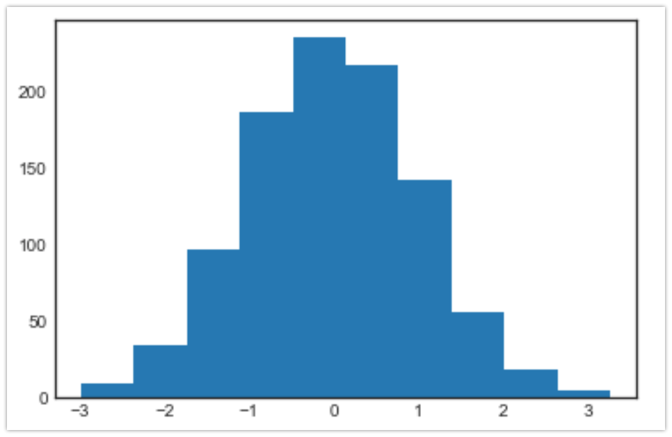                                                                                                                                                                                                                                                                                                                                                                                                                                                                                                                                                                                                                                                                                                                                                                                                                                                                                                                                                                                                                                                                                                                                                                                                                                                                                                                                                                                                                                                                                                                                                                                                                                                                                                                                                                                                                                                                                                                                                                                                                                                                                                                                                                                                                                                                                                                                                                                

```python
plt.hist(data, bins=30, alpha=0.5,
         histtype='stepfilled', color='steelblue',
         edgecolor='none');
```

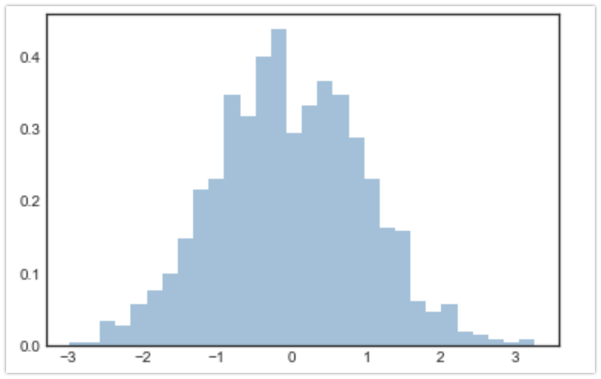

여러개의 히스토그램을 합 표시할 때, 투명도(alpha)를 결합하여 표시해보자

```python
x1 = np.random.normal(0,0.8,1000) #평균 0, 표준편차 0.8인 숫자 1000개
x2 = np.random.normal(-2,1,1000)
x3 = np.random.normal(3, 2, 1000)
plt.hist(x1, bins=40, alpha = 0.3)
plt.hist(x2, bins=40, alpha = 0.3)
plt.hist(x3, bins=40, alpha = 0.3)
```

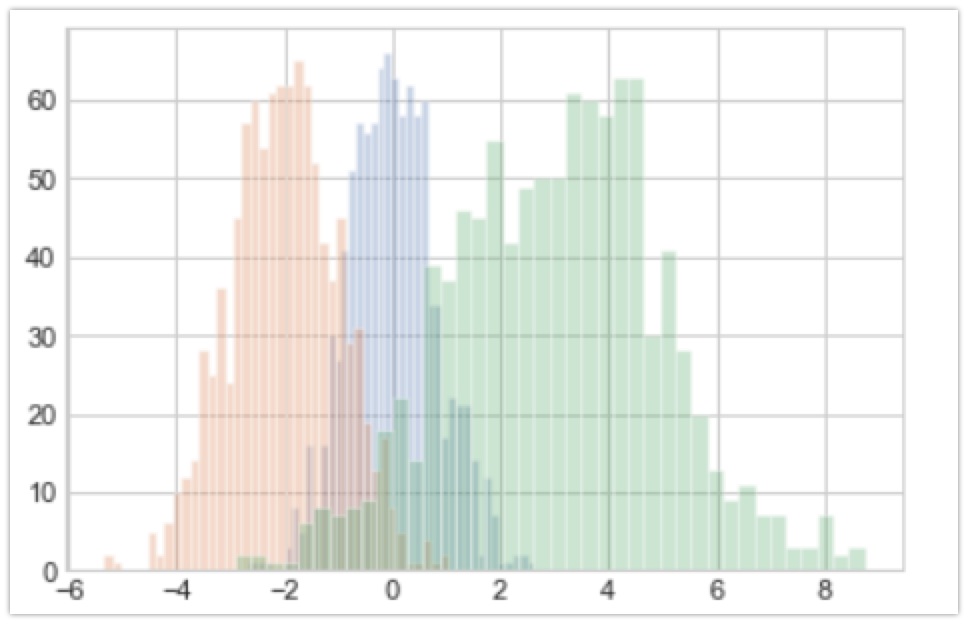

### 

### 예제) 다음 히스토그램을 그려봅시다.

앞의 퀴즈에서 진행한 모바일 앱 데이터프레임에서 앱의 사용자 평점(user_rating)마다 구분하여 표시하는 히스토그램을 그리자

- 데이터셋 : apple_store 2.csv

- 사용컬럼 : user_rating

- 데이터셋 불러오기

  ```python
  app = pd.read_csv('apple_store 2.csv')
  app.head()
  ```

  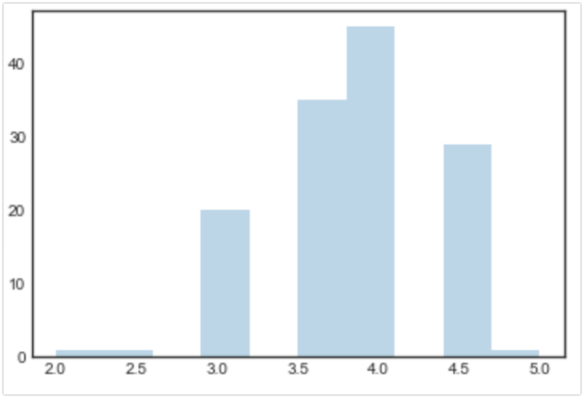


# 2차원 히스토그램

데이터를 구간으로 나누어 1차원에 히스토그램을 만드는 것처럼 점을 2차원 구간에 나누어 2차원 형태의 히스토그램을 그릴 수 있다.

2차원 히스토그램을 그리는 방법은 plt.hist2d() 메서드를 사용하는 것이다.

```python
x = np.random.randn(10000)
y = np.random.randn(10000)

plt.hist2d(x, y, bins=10, cmap='Blues')
```

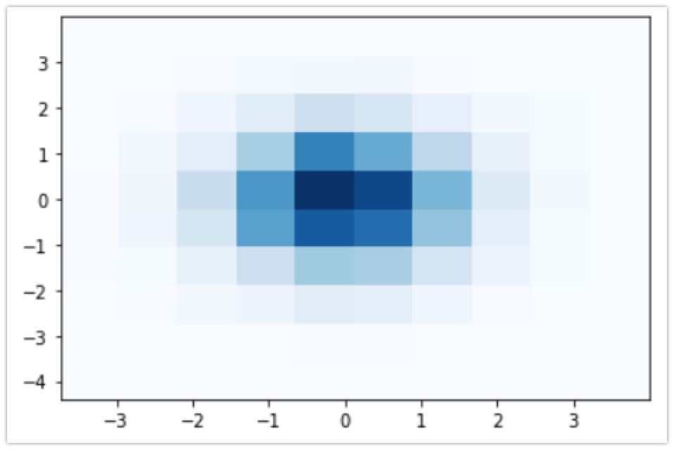


# 플롯 범례 변경하기

범례는 그려지는 데이터에 레이블(이름)을 할당해 시각화하는 데이터를 이해하는데 도움을 준다. 가장 간단한 범례는 레이블이 추가된 플롯요소에 범례를 자동으로 만들어주는 plt.legend() 명령어로 만들 수 있다.

```python
plt.style.use('classic')

x = np.linspace(0,10,1000)
fig = plt.figure()
plt.plot(x, np.sin(x), '-b', label='Sin')
plt.plot(x, np.cos(x), '--r', label='Cos')

plt.legend()
```

범례의 위치를 변경하기 위해서는 loc 키워드를 범례의 테두리는 frameon으로 변경할 수 있다.

- loc : upper[lower] left[center|center]
- frameon : True | False

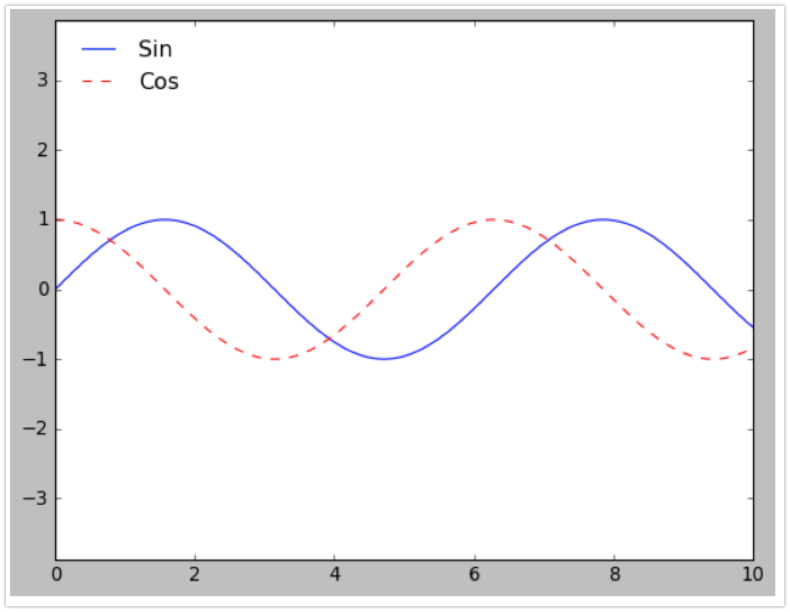


범례에 사용되는 열의 개수를 지정하는 데는 ncol 명령어를 사용한다.

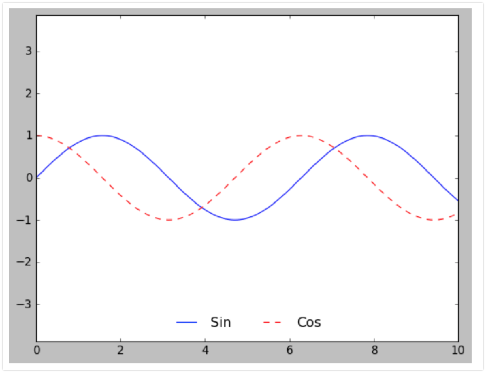


둥근 모서리 박스를 테두리로 사용하려면 fancybox 키워드를, 음영(shadow)을 추가하고 테두리의 투명도(framealpha)를 변경하거나 텍스트 굵기를 변경(borderpad)할 수 있다.

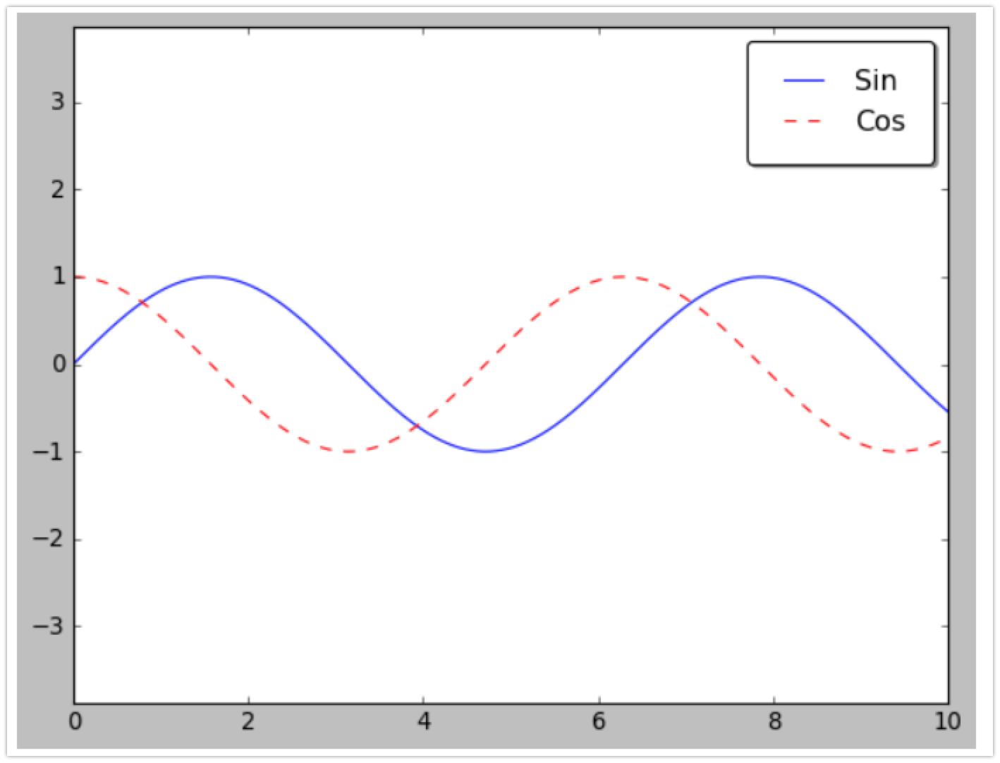


# 점 크기에 대한 범례

산포도에서 데이터의 어떤 특징을 점 크기로 표시하고 이를 반영한 범례를 만들어보자. 여기서는 점의 크기를 사용해 캘리포니아주 도시들의 인구를 표시하는 예제를 진행하자. 필요한 데이터를 우선 불러오자.

```python
cities = pd.read_csv('./data/california_cities.csv')
cities.head()

lat = cities['latd']		# 위도
lon = cities['longd'		# 경도
population = cities['population_total'] # 도시의 인구수
area = cities['area_total_km2']					# 도시의 면적
```

도시의 위도와 경도에 색상으로 인구수 점의 크기는 면적으로 표시하는 산포도를 그리자

```python
plt.scatter(lon,lat,c=np.log10(population),
           cmap='viridis', s=area, label=None, alpha=0.5)
plt.colorbar(label='log$_{10}$(population)') # $_{아래첨자}$
```

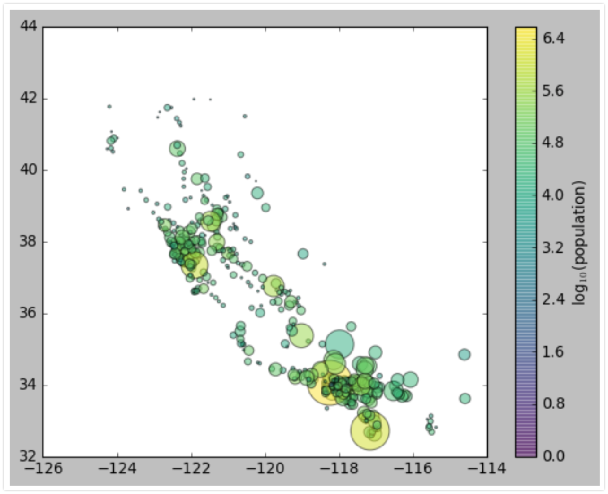

기본적으로 범례는 플롯상의 데이터를 참조해야 한다. 이 경우에는 원하는 데이터(아래 그림의 회색원)이 플롯상에 없어 빈 리스트를 플로팅해 가짜 데이터를 만든다.

```python
for area2 in [100, 300, 500]:
    plt.scatter([],[], alpha=0.3, s=area2,
               label=str(area2)+'km$^2$') # $^윗첨자$

plt.legend(scatterpoints=1, frameon=False, 
               labelspacing=1, title='City Area')
```

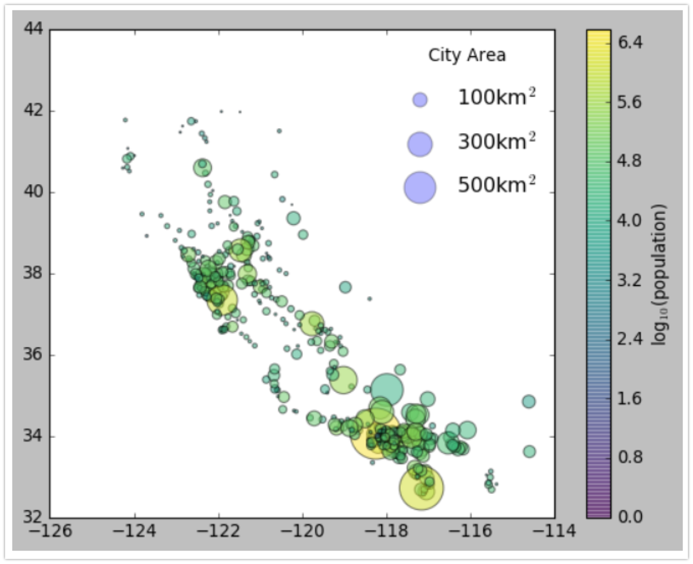


# 서브 플롯 (SubPlot)

서로 다른 데이터 뷰를 나란히 비교하면 데이터를 이해할 때 도움이 될 때가 있다. 서브 플롯은 하나의 figure 안에 더 작은 플롯을 여러개 모아놓은 것을 의미한다.

서브플롯은 plt.subplot() 메서드를 활용하여 그릴 수 있다. plt.subplot(격자의 행, 격자의 열, 서브플롯의 인덱스)함수는 그리드(격자)안에 들어갈 여러 서브플롯을 생성한다.

```python
plt.subplots_adjust(hspace=0.5, wspace=0.3)
for i in range(1,7):
    plt.subplot(2,3,i)
    plt.text(0.5, 0.5, str((2,3,i)),fontsize=18, ha='center')
```

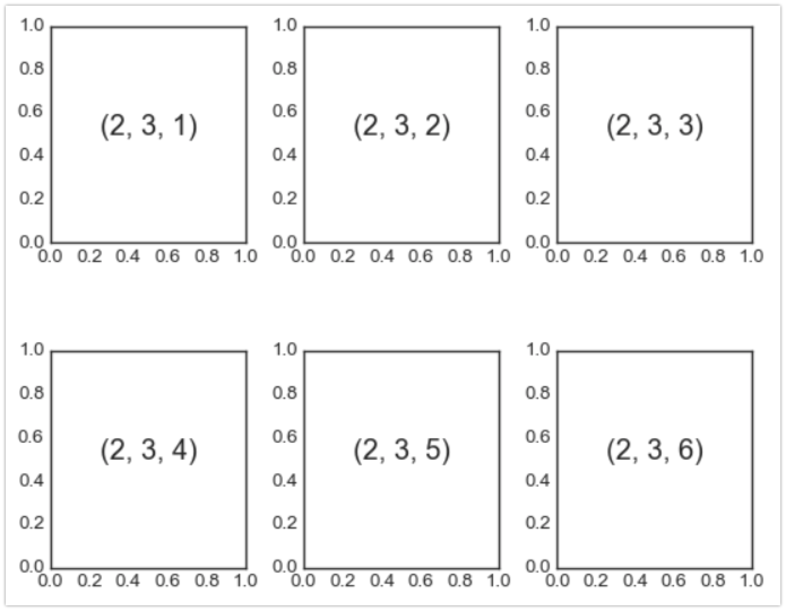


각 서브플롯은 각기 다른 플롯을 그릴 수 있다.

```python
x = np.linspace(0,10,100)
x_h = np.random.randn(100)
y_h = np.random.randn(100)

plt.figure(figsize=(20, 3))

plt.subplot(1,3,1)
plt.scatter(x, np.sin(x))

plt.subplot(1,3,2)
plt.plot(x, np.cos(x))

plt.subplot(1,3,3)
plt.hist2d(x_h, y_h, bins=30, cmap='Blues')
```

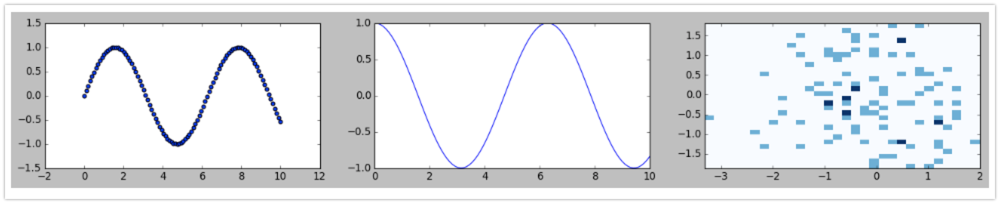

서브 플롯에 그래프 대신 이미지를 추가하여 배치할 수도 있다. 이때는 imshow() 메서드를 활용한다.

```python
import matplotlib.image as mpimg	# 이미지를 불러오기 위한 matplotlib.img 모듈 임포트

img_banana = mpimg.imread('./assets/banana.jpg')	# 이미지 파일을 읽어온다
img_apple = mpimg.imread('./assets/apple.jpg')

plt.figure(facecolor="#FFFFFF")		# figure의 배경색을 흰색으로 설정

plt.subplot(1,2,1)
plt.imshow(img_banana)		# imshow() 메서드로 이미지를 인수로 전달
plt.axis('off')						# 축을 표시하지 않는다.

plt.subplot(1,2,2)
plt.imshow(img_apple)
plt.axis('off')
```

 


### 예제) 다음과 같이 서브플롯을 그려봅시다.

- figure의 크기를 조정하는 코드

  ```
  plt.figure(figsize=(5,8)) # 너비 5, 깊이 8로 설정
  ```

- 첫번째 히스토그램 : 평균이 0이고 표준편차가 1인 값 1000개
- 두번째 라인플롯 
  - 데이터 : x = [2011, 2012, 2013, 2014, 2015, 2016, 2017], y = [3.68, 2.29, 2.90, 3.34, 2.79, 2.83, 3.10]

- 세번째 그림 : assets/lemon.png (편의상 다른 그림을 써도 좋습니다.)

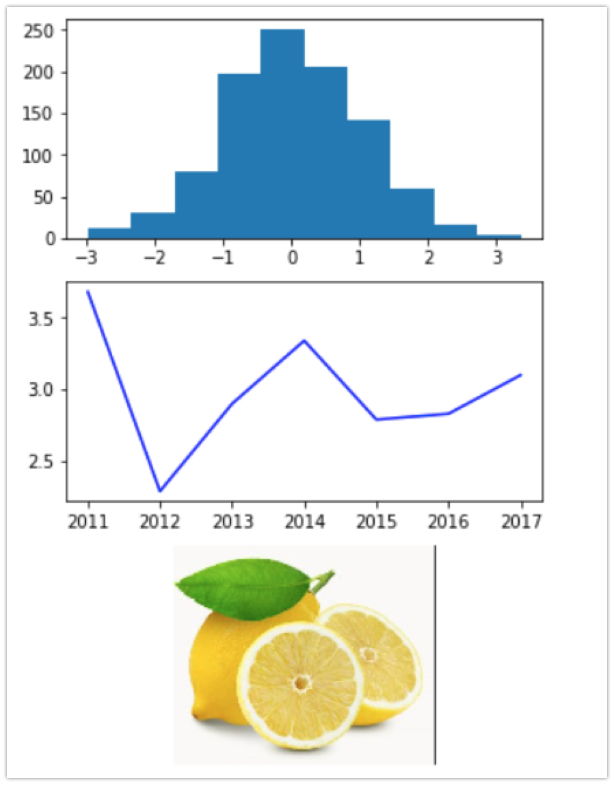


# 3차원 플롯 그리기

Matplotlib 안에 포함된 mplot3d 툴킷을 임포트해서 3차원의 플롯을 그릴 수 있다. 그리기 전에 다음과 같이 임포트하자. 추가적으로 numpy와 Matplotlib.pyplot도 임포트한다.

```python
from mpl_toolkits import mplot3d
import numpy as np
import matplotlib.pyplot as plt
```

우선 3차원의 축을 만들자 plt.axes()메서드에 인수로 projection='3d'키워드를 전달하여 3차원 축을 만들 수 있다.

```python
fig = plt.figure()
ax = plt.axes(projection='3d')
```

다음과 같이 축을 만들었다.

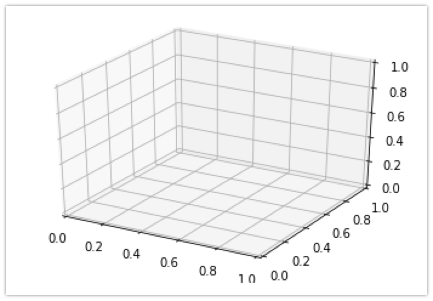

2차원의 플롯과 유사하게 ax.plot3D와 ax.scatter3D 함수를 이용해 3차원 플롯을 그릴 수 있다. 사용되는 방식이 2차원의 함수와 거의 같으니 참고하자. 여기서는 3차원의 라인플롯으로 삼각함수 나선을 그린 후 선 근처에 무작위로 3차원의 산점도를 그린다. 우선 데이터를 만들자.

```python
ax = plt.axes(projection='3d')

# 3차원 선을 위한 데이터
zline = np.linspace(0, 15, 1000)
xline = np.sin(xline)
yline = np.cos(zline)

# 3차원 산점도를 위한 데이터
zdata = 15 * np.random.random(250)
xdata = np.sin(zdata) + 0.1 * np.random.randn(250)
ydata = np.cos(zdata) + 0.1 * np.random.randn(250)

# 3d 라인 플롯 작성
ax.plot3D(xline, yline, zline, 'gray')

# 3d 산점도 작성
ax.scatter3D(xdata, ydata, zdata, c=zdata, cmap='Greens')
```

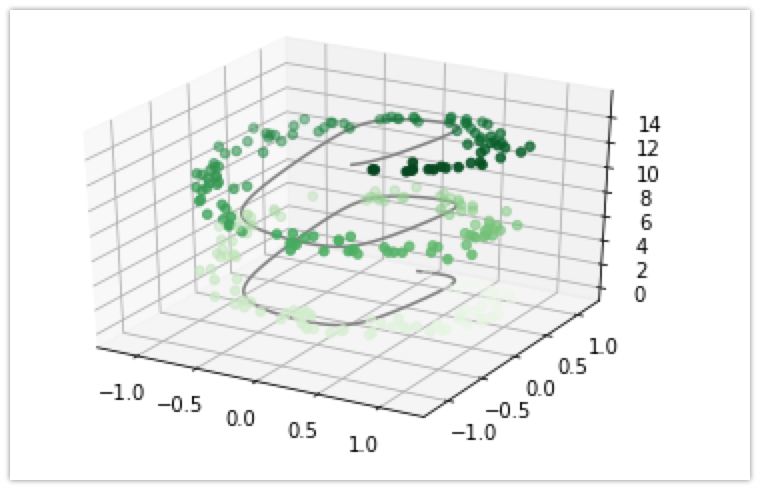


# 스타일시트 

Matplotlib에서는 style 모듈을 지원하여 더 세련된 플롯을 그릴 수 있도록 지원한다. 스타일시트의 종류를 확일하는 명령어는 다음과 같다.

```
plt.style.available
```

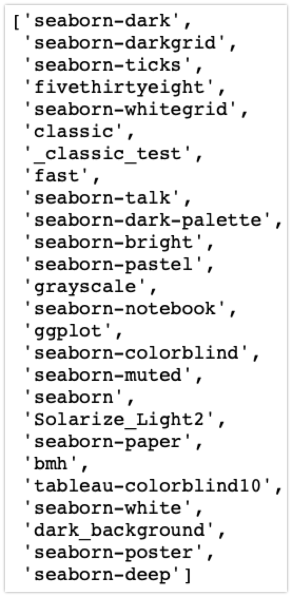

스타일의 종류를 파악했으니 적당한 스타일 시트를 선택하여 적용하자. plt.style.use("스타일 이름") 메서드 안에 원하는 스타일의 이름을 넣자.

```python
plt.style.use("seaborn-deep")
x = np.linspace(0,10,100)
plt.plot(x, np.cos(x))
```

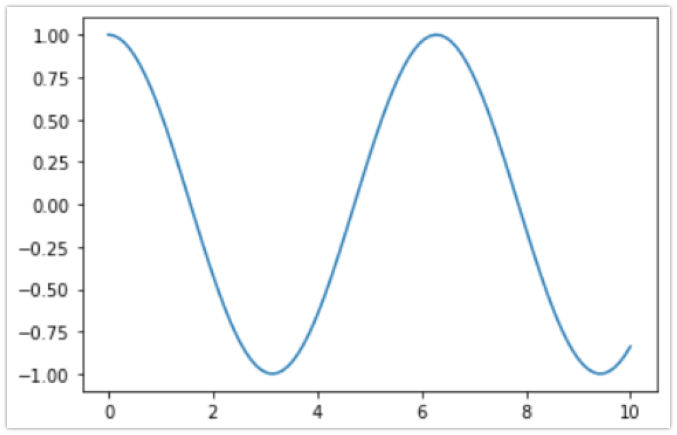

```python
plt.style.use("ggplot") # 스타일 시트를 ggplot으로 변환
x = np.linspace(0,10,100)
plt.plot(x, np.cos(x))
```

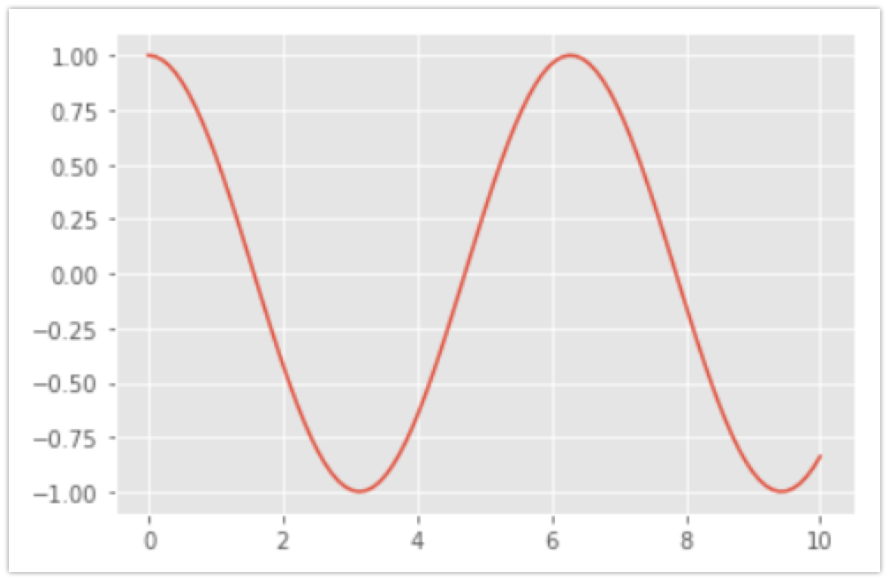


# 머신러닝

머신러닝은 간단히 "데이터를 이용한 모델링 기법"이라 할 수 있다. 더 설명하면 '데이터'에서 '모델'을 찾아내는 기법으로 여기서 '데이터'는 말 그대로 문서, 음성, 이미지 등의 자료를 말하고 '모델'은 머신러닝으로 얻어내는 최종 결과물이다.


그렇다면 머신러닝에서 학습(learning)이라는 단어가 붙었을까? 그 이유는 **머신러닝 기법이 데이터를 분석해 모델을 스스로 찾아내기 때문**이다.

즉, 머신러닝 기법으로 데이터에서 모델을 찾아내는 과정이 마치 기계가 데이터를 학습해 모델을 알아내는 것과 비슷해서 이름이 붙었다. 머신러닝이 모델링에 사용하는 데이터를 '학습 데이터'라고 부른다.


아래 그림들을 학습하면, 빨강색이고 크레인이 있고, 바퀴가 있는 자동차는 소방차로 인식하는 모델을 만들 수 있다. 


앞에서의 내용을 그림으로 그리면 다음과 같이 표현할 수 있다.

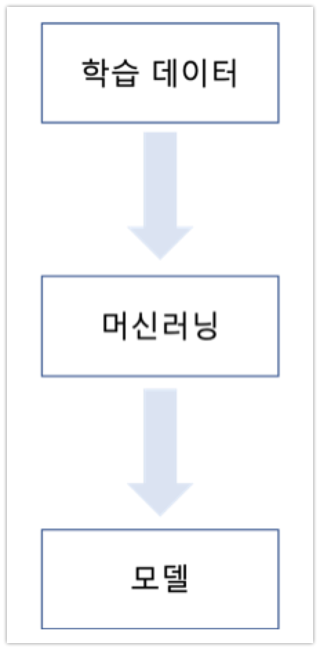


## 모델

모델은 만들려는 최종 결과물이다. 예를 들면 이메일을 분석해 스팸 메일을 자동으로 분류하는 시스템에서 모델은 '스팸 메일 분류기'가 머신러닝에서 말하는 모델에 해당한다.

모델링 기법에는 머신러닝만 있는 것이 아니다. 동역학 분야에서 뉴턴의 운동법칙을 이용해 물체의 운동을 방정식으로 표현하는 것도 전통적인 모델링 방법이라 할 수 있다.

그러나 법칙이라 논리적으로 모델링하기 어려운 분야가 있다. 아래 그림을 보자. 이 숫자들은 무엇일까?

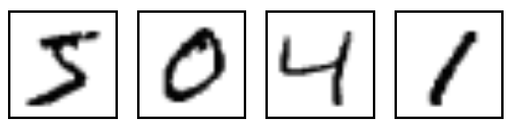

전통적 모델링 방법으로 법칙이나 알고리즘을 찾아야 한다면? 그 법칙은 무엇인가? 


우리는 어렸을 때부터 이건 5, 0이라 배웠고 그냥 그렇게 인식하였다. 그후 다양한 숫자들을 접하면서 점점 구별을 뚜렸하게 되었다.


머신러닝은 이처럼 명시적인 규칙으로 모델을 구하기 어려운 문제를 해결하기 위한 방법이다. 즉, 공식이나 법칙으로 접근하기 어려운 경우에는 학습 데이터를 이용해 모델을 구하는 것이 머신러닝의 핵심 개념이다.


## 머신러닝의 난재

물리법칙, 수학공식으로는 모델링이 불가능했던 영상인식, 음성인식등의 문제를 해결하는데 머신러닝은 적합하지만, 이러한 접근법이 문제의 원인이 되기도 한다. 이 부분에서는 머신러닝이 근원적으로 어떤 문제를 내포하는지 알아보자. 


머신러닝 기법을 통해 학습 데이터로부터 모델을 찾아내면 실제 현장의 데이터를 입력하여 사용한다.

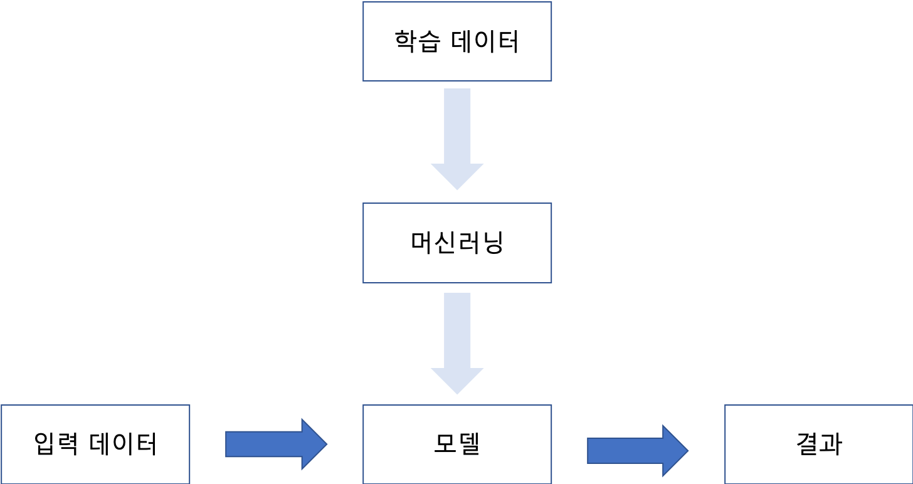


세로축의 표시된 절차는 앞에서의 학습과정을 나타낸다. 학습된 모델을 실제로 사용하는 가로축의 과정을 추론이라 한다.  학습데이터와 입력데이터에 주목하자.


다음과 같은 학습 데이터를 가지고 모델을 만들었다.

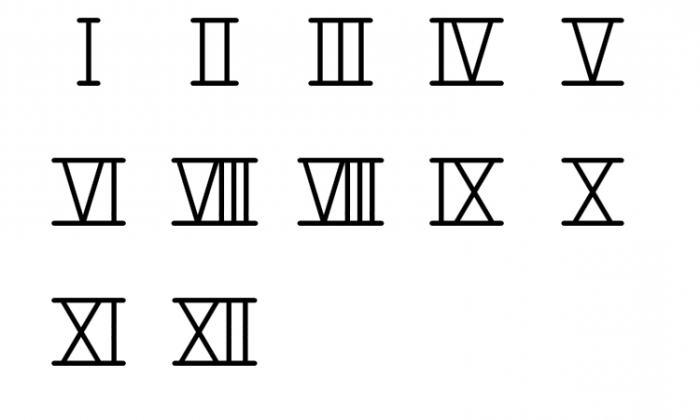

모델에 입력데이터를 다음과 같이 넣었다.

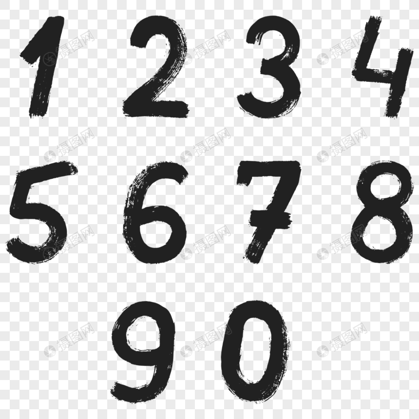


숫자가 잘 인식될 수 있을까?


학습 데이터가 실제 입력될 데이터의 특징을 반영되어 있지 못하다면 모델은 제대로 작동할 가능성이 없다.

따라서 머신러닝 기법을 사용할 때는 **실제 데이터의 특성이 잘 반영되어 있고 편향되어 있지않은 데이터를 확보하는 것이 중요**하다.


학습 데이터와 입력 데이터가 달라져도 성능 차이가 나지 않게 하는 것을 **'일반화 (generalization)'**이라 한다.


## 과접합

머신러닝에서 일반화 성능을 떨어뜨리는 주머 중 하나가 **'과적합 (overfitting)'** 이다. 다음 그림을 보고 이해해보자. 그림에 표시된 동그라미, 세모 학습데이터를 두 분류로 나누는 선을 찾는 것이 목표이다. 

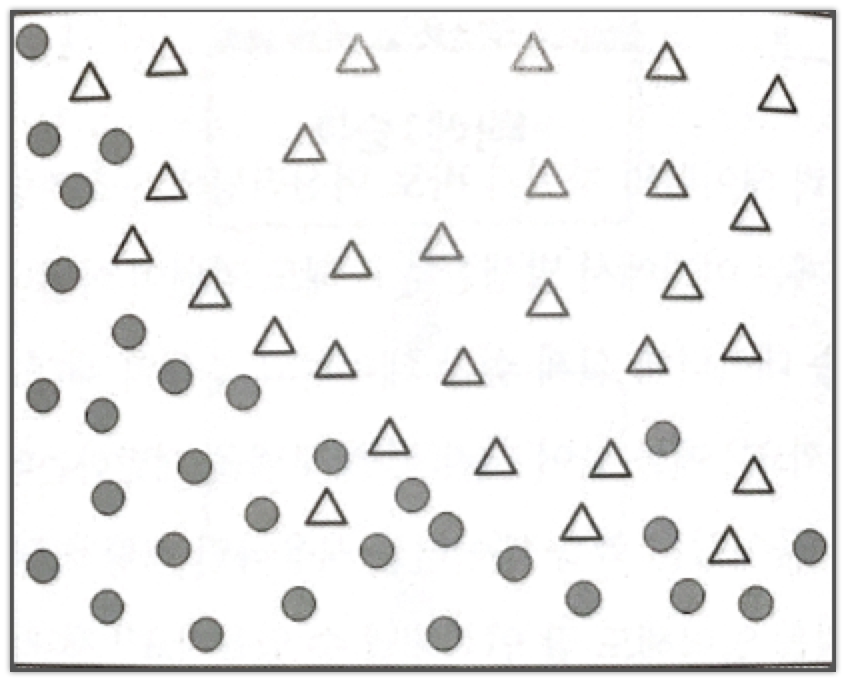

다음과 같이 곡선을 그리면 대체적으로 두 분류로 나눌 수 있을 것이다.

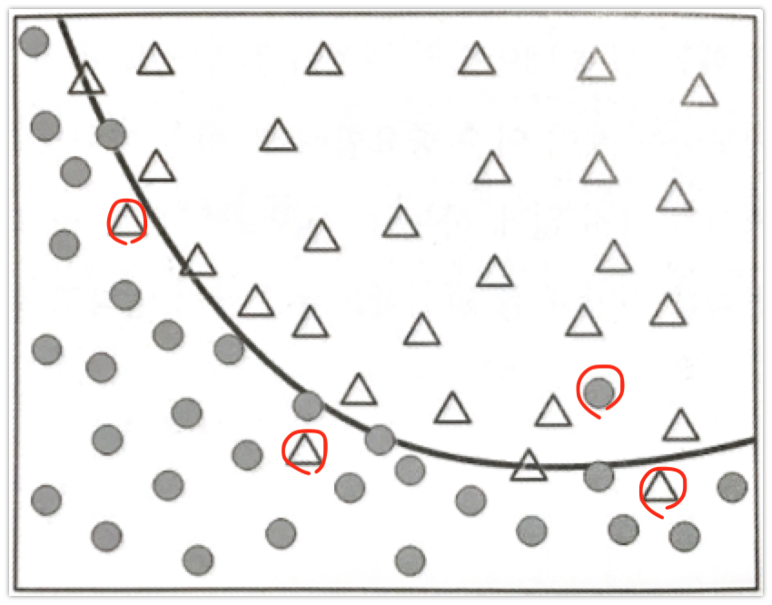

다만 앞의 그림에서 몇몇 잘못 분류되는 데이터(빨간색 표시)가 있으므로 다음과 같이 복잡한 곡선으로 기준을 잡는 모델을 만든다면?

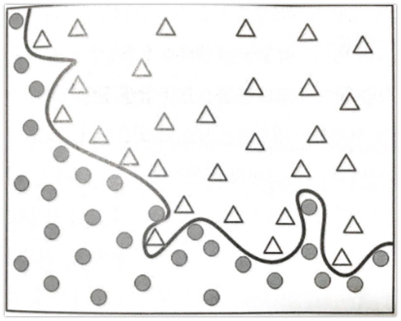


이모델은 완벽하게 데이터를 분류해 낼 수 있다. 이제 앞에서 그림과 같이 선을 기준으로 데이터를 분류해보면 새로 입력 받은 데이터를 네모로 표시하자.

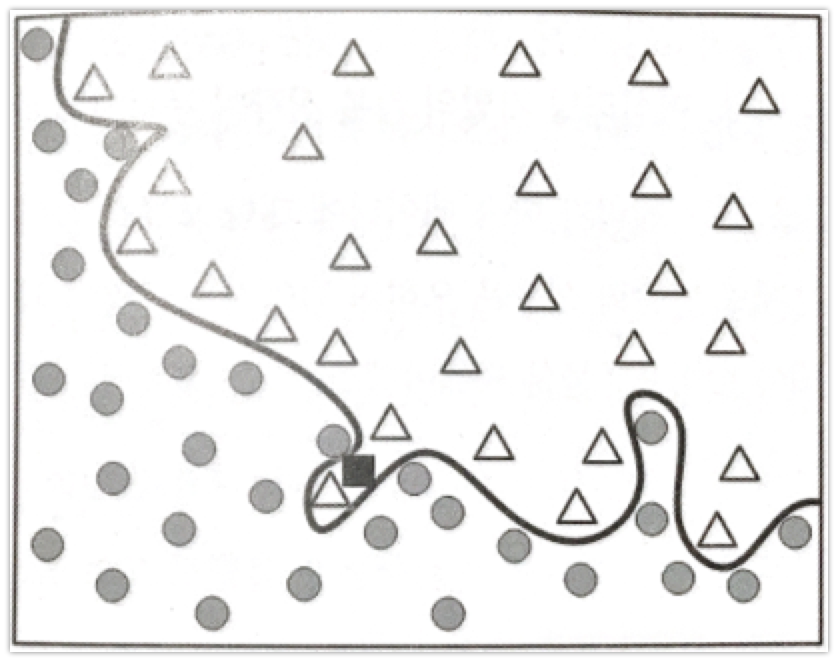

구분선에 따라 모델은 네모를 세모로 분류하지만 얼핏보면 동그라미가 더 주변에 많기에 동그라미일 가능성도 남아있다.


다음 학습 데이터를 보면 중간중간에 상대편에 깊숙히 들어가 있는 데이터는 전체적인 경향에 벗어나 있다(빨강색 원). 즉 이 데이터 들은 잡음이 많이 섞인 데이터 이다. 앞에서 만든 구분선은 잡음섞인 데이터까지 모두 고려하여 제대로 동작하지 않는 모델을 얻었다.

 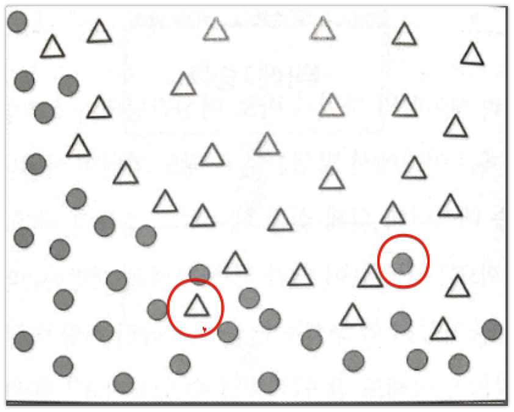


## 과접합 해소하기

앞의 그림에서 복잡한 모델(구분선)은 과적합이 일어나기 쉬웠다. 학습데이터에 대한 모델의 성능을 약간 희생하여도 최대한 간단하게 만들어 과적합에 빠지지 않는것이 기본 전략이다. 간단한 데이터라면 학습 데이터와 모델을 그려 과적합 여부를 판단할 수 있다. 하지만 실제 문제는 대부분 입력 데이터의 차원이 높기 때문에 그림을 그리는 방법은 효과적이지 못하다.


이를 위해 검증이라는 방법을 사용한다. 검증은 학습 데이터의 일부를 떼어 내서 학습에 사용하지 않고 모델의 성능 검증용으로 사용하는 기법을 이른다.  검증을 적용하면 다음과 같이 학습이 진행된다.

1. 학습 데이터를 학습용 데이터와 검증용 데이터로 나눈다.

2. 학습용 데이터로 모델을 학습시킨다.

3. 검증용 데이터로 모델의 성능을 평가한다. 

   a. 성능이 만족스러우면, 학습을 마친다. 

   b. 성능이 떨어지면 모델의 구조 등을 수정해 2단계부터 다시 수행한다. 


### 교차 검증

교차검증은 데이터를 학습용과 검증용 데이터를 나누어 놓은 후 고정적으로 사용하는 것이 아니라 중간마다 다시 바꾸어 주는 방법이다.

검증용 데이터를 고정해 높으면 모델이 검증용 데이터에 과적합될 여지가 있음을 방지한다.

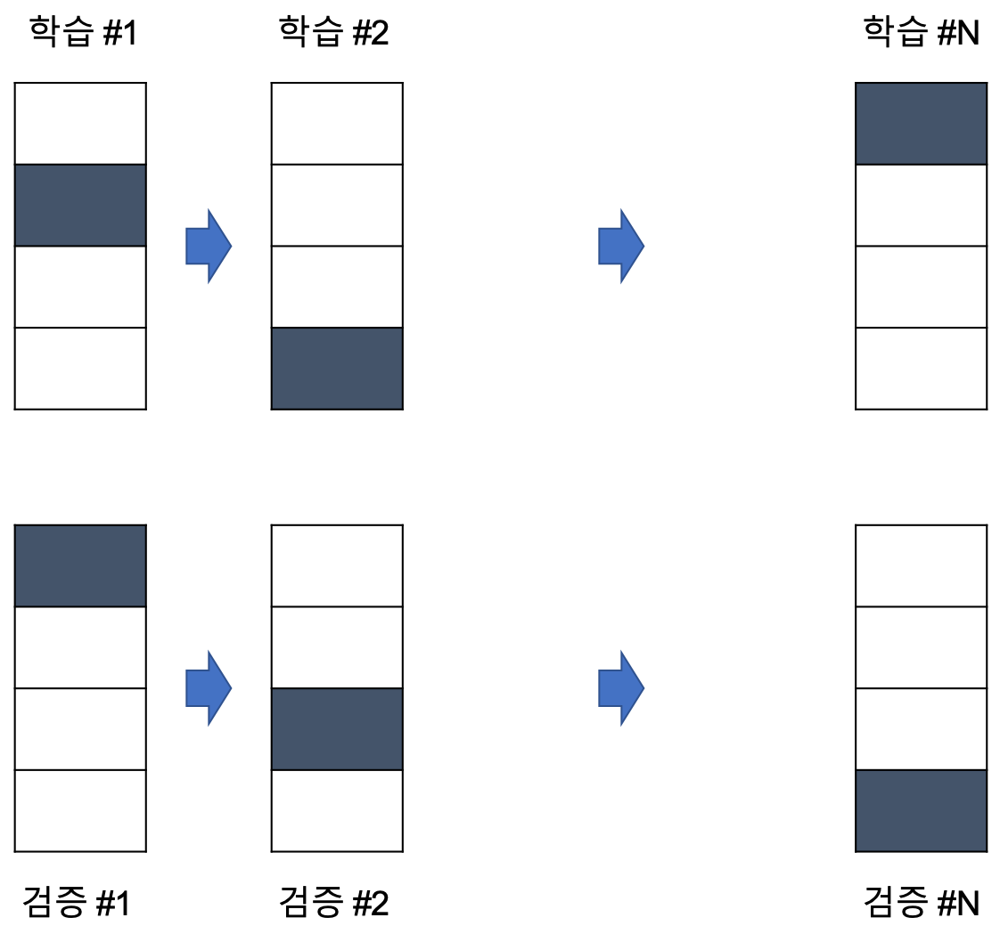


## 머신러닝의 종류

머신러닝 기법들은 학습 방식에 따라 크게 2종류로 나눌 수 있다.

### 지도 학습

지도학습은 사람이 무엇을 배우는 과정과 매우 비슷하다. 연습 문제를 풀면서 새로운 지식을 공부하는 과정을 예로 들어보자.

1. 연습문제를 하나 고른다. 배운 지식으로 이 문제에 대한 답을 구한다. 이 답을 정답과 비교한다.
2. 틀렸다면 잘못된 학습 내용을 교정한다.
3. 모든 연습 문제에 관해 1,2 단계를 반복한다.

머신러닝의 개념과 비교하면 연습 문제, 정답은 학습 데이터, 지식은 모델에 해당한다.  학습은 '입력'에 대한 모델의 출력과 해당 '정답'의 차이가 줄도록 모델을 수정하는 과정이라 볼 수 있다. 지도학습으로 완벽하게 학습된 모델은 학습 데이터에서 어떤 입력을 받으면 주어진 해당 정답을 출력한다.


### 비지도 학습

비지도 학습의 데이터는 입력만 있고 정답은 없는 형태로 되어 있다. 비지도 학습은 주로 데이터의 특성을 분석하거나 데이터를 가공하는데 사용된다. 정답이 없으므로 해법(정답)을 특정하지 못하고 문제의 구문이나 형태를 가지고 유형을 나누는 형태(군집화(clustering))로 동작한다.


# 머신러닝을 위한 Scikit-Learn

파이썬에는 다양한 머신러닝 알고리즘을 구현한 Scikit-Learn 이라는 라이브러리가 있다. Scikit-Learn은 간단한 Estimator API를 활용하여 다양한 알고리즘의 모델을 활용할 수 있다.

모델을 적용하는 단계는 다음과 같다.

1. Scikit-Learn으로 부터 적절한 알고리즘(추정기(estimator))클래스를 임포트하여 모델의 클래스를 선택
2. 클래스를 인스턴스화하여 초모수(하이퍼파라미터 : (머신러닝 분야에서)연산을 하기 위해 필수로 필요한 매개변수)를 선택한다.
3. 데이터를 배치한다
4. 모델 인스턴스의 fit() 메서드를 호출해 모델을 데이터에 적합(학습)시킨다.
5. 모델을 새 데이터(검증)에 적용한다. predict() 메서드를 사용해 알려지지 않은 데이터에 대한 레이블(결과)를 예측


# 머신러닝의 대표적 분석 방법

- 분류 : 정답 데이터에서 분류 규칙을 학습하여 미지의 데이터에서도 분류할 수 있게 하는 것이 목표이다.
- 회귀 : 주어진 데이터에서 수치를 예측한다. 분류와 마찬가지로 정답 데이터의 규칙을 배워 미지의 데이터에도 대응하는 수치를 예측한다.
- 클러스터링 : 데이터의 성질에 맞는 데이터의 분류(클러스터)를 만든다 데이터의 성질에 따라 판단하므로 정답 데이터가 필요하지 않다.


# 분류

머신러닝에서 분류는 지도 학습 데이터(정답이 있는 데이터)에 따라 학습하여 미지의 데이터를 분류하는 것을 목표로 한다. 아래의 그림은 색상과 크기로 과일을 분류하는 예시이다.

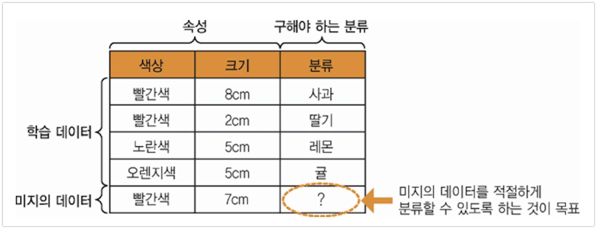


다른 예시로 미지의 데이터를 두 가지로 분류한다고 하자. 2차원 평면에 분포한 데이터를 분할하는 직선을 찾아 표기하면 쉽게 데이터를 구분할 수 있다. 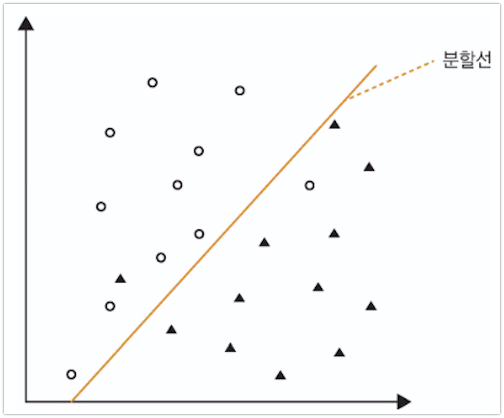

실제의 데이터는 2차원보다 높은 차원일 수 있고 알고리즘에 따라 구분선이 그림처럼 직선이 아닐 수도 있다. 이전의 과적합 이야기를 했을 때처럼 전체 학습 데이터를 정확하게 분할하는 구분선을 구하는 것을 불가능하며, 약간의 오차를 허용하게 된다.


# 분류기 만들기

Scikit-learn을 사용해 실제로 분류기를 만들어보자. 여기에서는 Scikit-learn에 포함된 손으로 쓴 숫자 데이터셋인 digit를 사용하자.


## digits 데이터셋

digit 데이터셋은 0부터 9까지 손으로 쓴 숫자 이미지 데이터로 구성되어 있다. 우선 이미지를 확인해보자.

```python
import matplotlib.pyplot as plt
from sklearn import datasets

digits = datasets.load_digits()

for label, img in zip(digits.target[:10], digits.images[:10]):
    plt.subplot(2,5,label+1)
    plt.axis('off')
    plt.imshow(img, cmap=plt.cm.gray_r)
    plt.title('Digit:%d' % label)
```

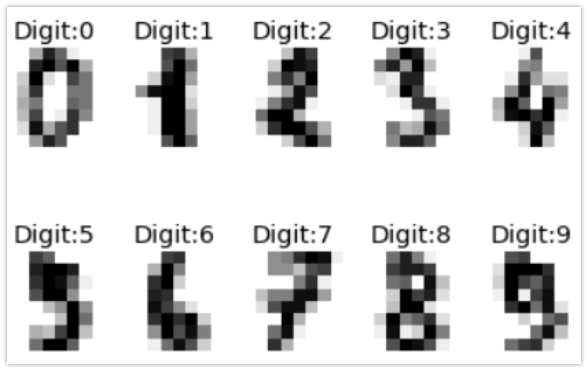


## 분류기를 만들어 평가

Scikit-learn을 사용해 3과 8 이미지 데이터를 분류하는 분류기를 만들자 먼저 손으로 쓴 숫자 이미지 데이터를 읽자.

```python
import numpy as np
from sklearn import datasets

digits = datasets.load_digits()		# 손으로 쓴 숫자 데이터 읽기
flag_3_8 = (digits.target==3) | (digits.target==8)		# 3과 8 데이터 위치 구하기

# 3과 8의 데이터 구하기
images = digits.images[flag_3_8]
labels = digits.target[flag_3_8]

# 3과 8 이미지 데이터를 1차원으로 나열
images = images.reshape(images.shape[0],-1)
```


이제 분류기를 만들어 학습하자 여기서는 결정 트리 알고리즘을 사용하여 분류기를 만든다.

```python
from sklearn import tree

# 3과 8의 이미지 데이터 수를 구한다.
n_samples = len(flag_3_8[flag_3_8])

# 전체 데이터에서 60%는 학습데이터로 사용하고 나머지 40%는 검증 데이터로 활용하자.
train_size = int(n_samples * 3 / 5)

# 분류를 위한 알고리즘 객체 생성
classifier = tree.DecisionTreeClassifier()

# 학습 데이터로 모델을 학습 시킨다.
classifier.fit(images[:train_size], labels[:train_size])
```


## 성능 평가

마지막으로 분류기의 성능을 평가해보자. 분류기 성능을 평가하는데 사용하는 테스트 데이터는 학습 데이터에 쓰지 않았던 나머지 40%의 데이터를 활용하자.

```python
from sklearn import metrics

# 테스트 데이터의 이미지가 나타내는 값(3 or 8 인 정답)
expected = labels[train_size:]

# 테스트 데이터의 이미지
predicted = classifier.predict(images[train_size:])

# 모델의 정답률 (테스트 데이터의 이미지가 나타내는 값(정답)과 모델에서 예측한 값을 비교)
print('Accuracy : ', metrics.accuracy_score(expected, predicted))

```


# 분류기 성능 지표

앞에서 분류기를 만들고 정답률을 확인하였으나 만든 분류기의 성능을 다양한 지표로 더 자세하게 평가해보자.


## 성능 지표

설명을 위해 Positive와 Negative 중 하나를 반환하는 분류기를 만들었다고 가정하자 Positive와 Negative 각각의 정답과 오답이 있어 다음과 같이 4개의 조합이 생길 수 있다.

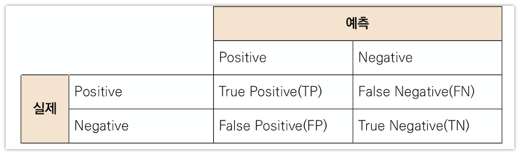

위의 그림을 혼동행렬(Confusion matrix)라 하며 분류기 평가에서 자주 활용한다. 행령에서 예측 결과가 맞다면 True, 틀리면 False라고 생각하자. 

True Positive(TP)는 Positive라는 예측이 정답인 상태이고, 

False Positive(FP)라면 Positive라는 예측이 오답이라는 의미이다.

반대로 Negative 예측에서도

True Negative(TN)은 Negative라는 예측이 정답인 상태이고,

False Negative(FN)라면 Negative라는 예측이 오답이라는 의미이다.


다음 4가지는 분류기의 성능지표로 활용된다.

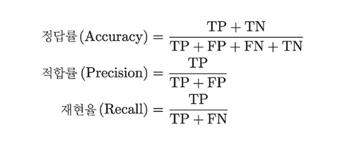

### 정답률 (Accuracy)

전체 예측 안에서 정답이 있는 비율이다. 혼동행렬과 같이 보면 이해가 빠르다.

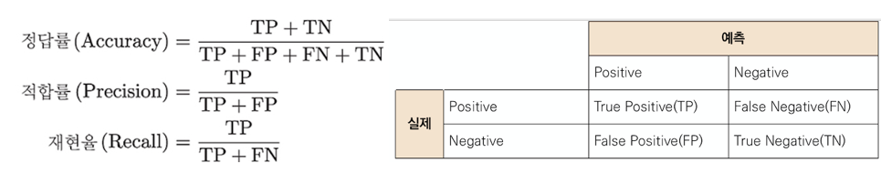


### 재현율 (Recall)

실제로 Positive인 것을 분류기가 얼마나 Positive라고 예측하였는지 나타내는 비율(실제로 Positive인 것을 빠뜨리지 않고 얼마나 잘 잡아내는지)

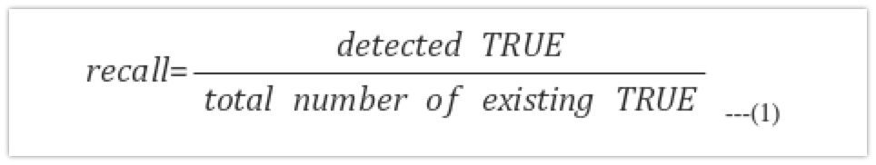


### 적합률 (Precision)

Positive로 예측했을 때 예측이 맞아 진짜로 Positive인 비율로 모델의 **예측 정확도**(검출 결과가 얼마나 정확한 지)를 나타내는 지표이다. 

Positive로 예측한 모든 경우의 수(True Positive + False Positive) 중에서 예측이 맞아 실제로 Positive인 경우

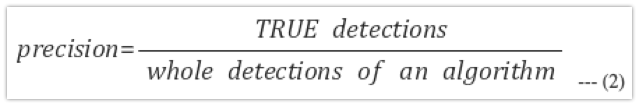


### F - measure

적합률과 재현률의 조화평균을 내어 계산한 지표

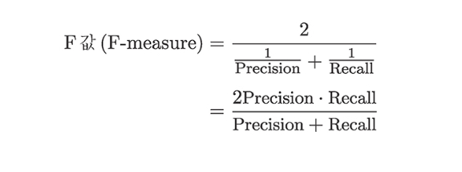

## 평가 코드

모델의 성능 지표를 알아보기 위해서는 metrics 클래스의 함수들을 활용한다.

```python
from sklearn import metrics

# 정답률
print('Accuracy : ', metrics.accuracy_score(expected, predicted))
# 혼동행렬 표시
print('Confusion matrix :\n', metrics.confusion_matrix(expected, predicted))

print("*"*50)

# 3에 대한 적합률
print('Precision : ', metrics.precision_score(expected, predicted, pos_label=3))
# 3에 대한 재현율
print('Recall : ', metrics.recall_score(expected, predicted, pos_label=3))
# 3에 대한 F measure
print('F-measure : ', metrics.f1_score(expected, predicted, pos_label=3))

print("*"*50)

# 8에 대한 적합률
print('Precision : ', metrics.precision_score(expected, predicted, pos_label=8))
# 8에 대한 재현율
print('Recall : ', metrics.recall_score(expected, predicted, pos_label=8))
# 8에 대한 F measure
print('F-measure : ', metrics.f1_score(expected, predicted, pos_label=8))
```

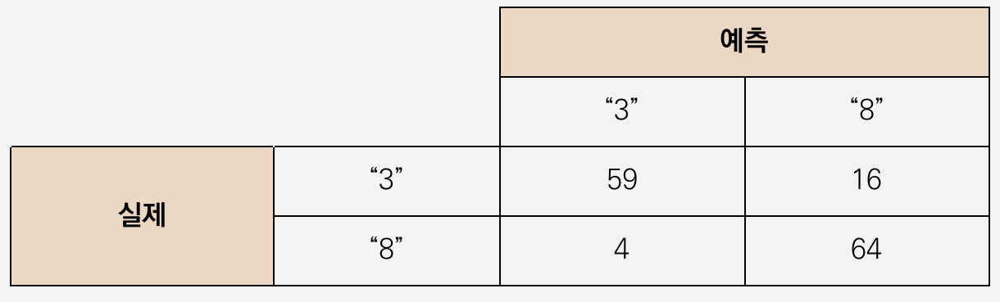


# 성능 지표의 해석

어떤 공장에서 제품의 결함을 찾는 분류기가 있다 성능지표가 아래와 같을 때 해석해보면,

- 정답률 : 98.6%
- 정상
  - 적합률 : 99.1% 
  - 재현률 : 99.5%
- 결함
  - 적합률 : 81.2%
  - 재현률 : 68.6%

우선 정상일 경우에 대해 적합률과 재현률을 따져보자.

재현률이 99.5%이므로 정상 제품을 거의 빠짐 없이 정상으로 인식함을 알 수 있고,  적합률을 보았을 때 정상으로 인식된 것들이 실제 확인해보니 정확도도 99.1%로 상당히 높다.


반대인 결함의 경우에도 살펴보자.

전체 결함 제품 중 결함으로 인식한 재현률 68.6%로 나머지 31.4%는 정상으로 인식하였다(결함품을 30% 정도 놓치고 있다).  한편 결함으로 판별한 제품 중에서도 적합률이 81.2%이므로 17.8% 정도로 오류를 범하고 있음을 알 수 있다.


적합률과 재현률은 반비례 관계이다. 알고리즘의 파라미터를 조절하여(판단 조건을 허술하게 하면) 검출률은 높아지지만 그만큼 오검출이 증가하고, 반대로 오검출을 줄이기 위해 판단 조건을 강화하면 정확도가 높아지지만 검출율이 낮아진다. 두 수치를 종합적으로 판단하고 싶다면, F-measure를 사용하여 판단하자.


# 분류 알고리즘

## 결정트리 (Decision Tree)

결정 트리는 데이터를 여러 등급으로 분류하는 지도학습으로 트리 구조를 이용한 분류 알고리즘이다. 분류 대상의 데이터의 속성에 따라 분류한다.

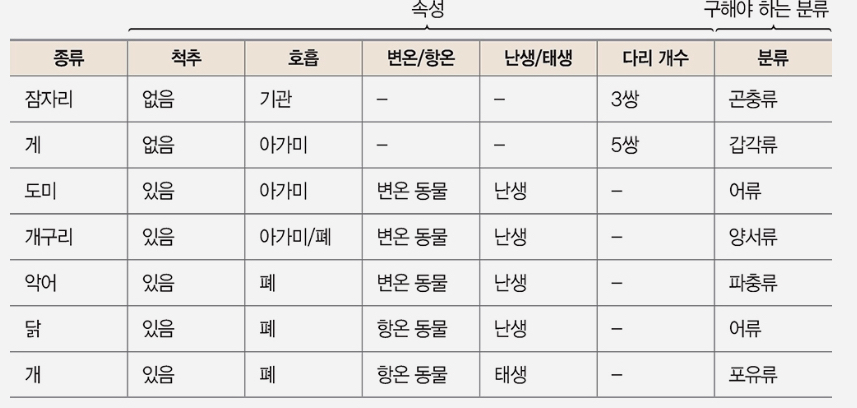

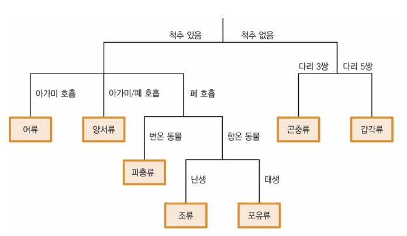

앞에서 만들었던 3과 8의 분류기 코드에 다음 처럼 속성을 입력하자. max_depth 속성은 트리 모델의 최대 깊이를 나타낸다. 

```python
...

# 분류를 위한 알고리즘 객체 생성
classifier = tree.DecisionTreeClassifier(max_depth=3)

...
```

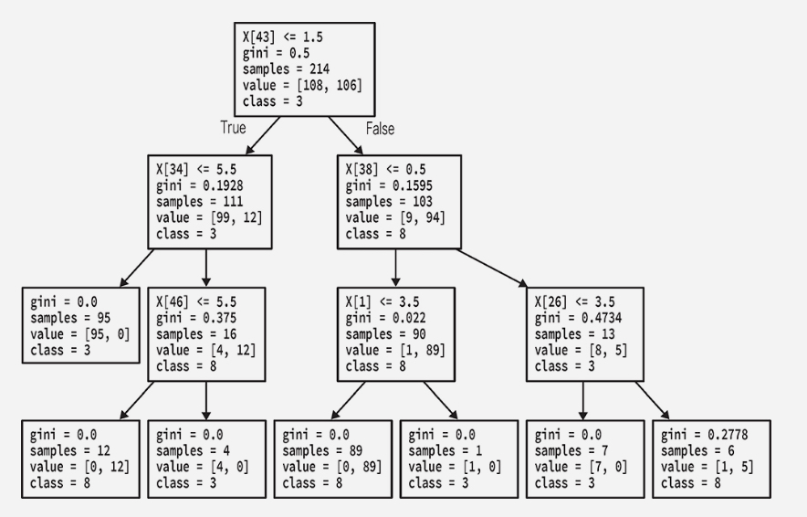

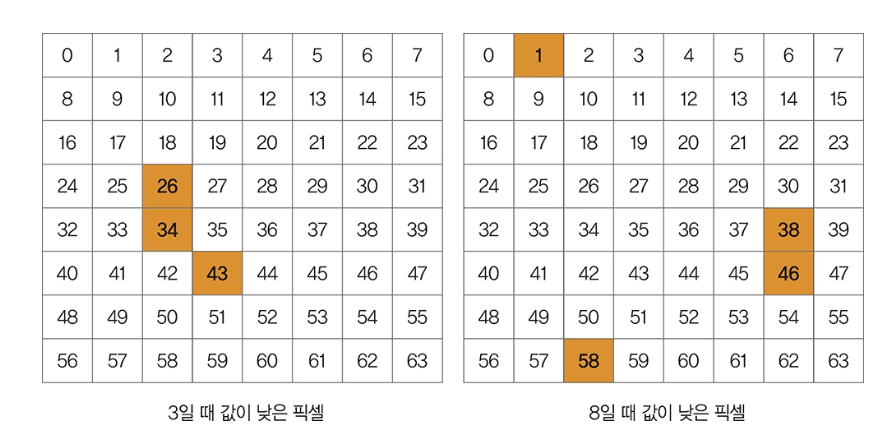

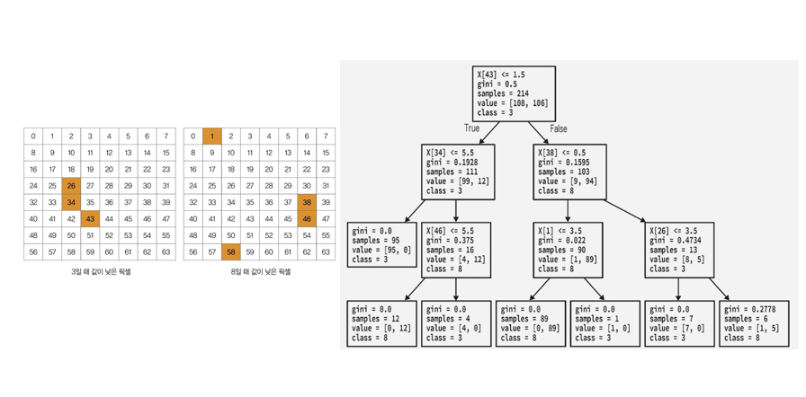


## 랜덤 포레스트 (Random Forest)

앞에서의 결정 트리는 과적합 하는 경향이 있어 단독으로 쓰이지 않고 다수의 결정 트리가 조합되어 사용(앙상블 학습)된다.


### 앙상블 학습

앙상블 학습은 몇 가지 성능이 낮은 분류기를 조합하여 성능 좋은 분류기를 만드는 방법이다. 나중에 각 분류기의 결과는 합쳐져 다수결로 결론을 낸다. 


### 랜덤 포레스트의 학습 형태

랜덤 포레스트는 전체 학습 데이터 중에서 중복이나 누락을 허용하여 학습 데이터셋을 여러개 추출한다.

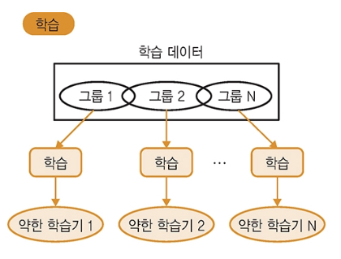

나누어진 학습 데이터를 활용해 부분적인 결정 트리를 생성한다. 결정 트리를 조합해 성능이 높은 모델을 만든다

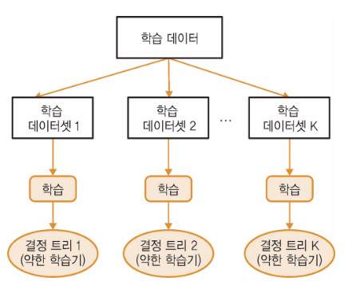


### 분류기의 생성

앞에서 3과 8의 이미지를 분류하는 분류기를 이번에는 랜덤 포레스트 방법으로 만들어 보자

위의 코드에서 생성기 객체를 만드는 부분을 다음과 같이 변경하자.

```python
...

"""
classifier = tree.DecisionTreeClassifier()
classifier.fit(images[:train_size], labels[:train_size])
"""
# 결정 트리 대신에 랜덤 포레스트 객체를 만든다.
from sklearn import ensemble
classifier = ensemble.RandomForestClassifier(n_estimators=20,
                                             max_depth=3)
classifier.fit(images[:train_size], labels[:train_size])

...
```

객체를 생성할 때 지정한 설정값으로

- n_estimator : 생성되는 학습기의 개 수

- max_depth : 생성된 학습기의 트리의 깊이


분류기 성능 평가를 위해 metrics 함수들을 실행해 보면 정답률이 높아짐을 확인 할 수 있다.

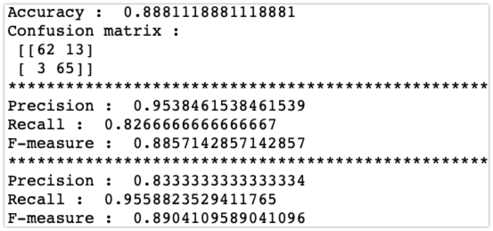

```python
from sklearn import metrics
# 정답률
print('Accuracy : ', metrics.accuracy_score(expected, predicted))
# 혼동행렬 표시
print('Confusion matrix :\n', metrics.confusion_matrix(expected, predicted))

print("*"*50)

# 3에 대한 적합률
print('Precision : ', metrics.precision_score(expected, predicted, pos_label=3))
# 3에 대한 재현율
print('Recall : ', metrics.recall_score(expected, predicted, pos_label=3))
# 3에 대한 F measure
print('F-measure : ', metrics.f1_score(expected, predicted, pos_label=3))

print("*"*50)

# 8에 대한 적합률
print('Precision : ', metrics.precision_score(expected, predicted, pos_label=8))
# 8에 대한 재현율
print('Recall : ', metrics.recall_score(expected, predicted, pos_label=8))
# 8에 대한 F measure
print('F-measure : ', metrics.f1_score(expected, predicted, pos_label=8))
```

 