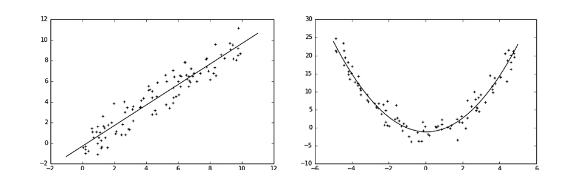
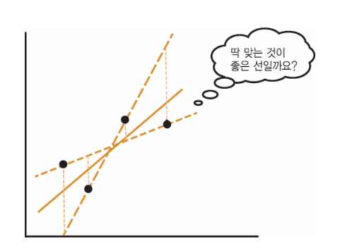
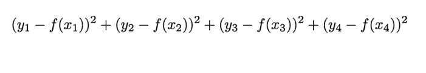
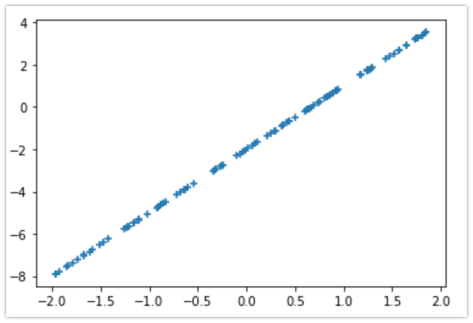
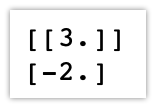
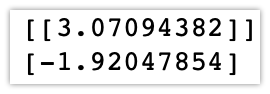
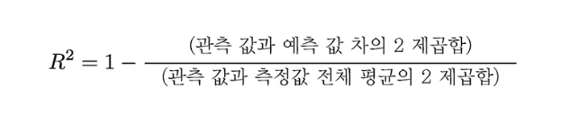
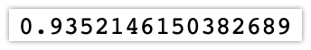
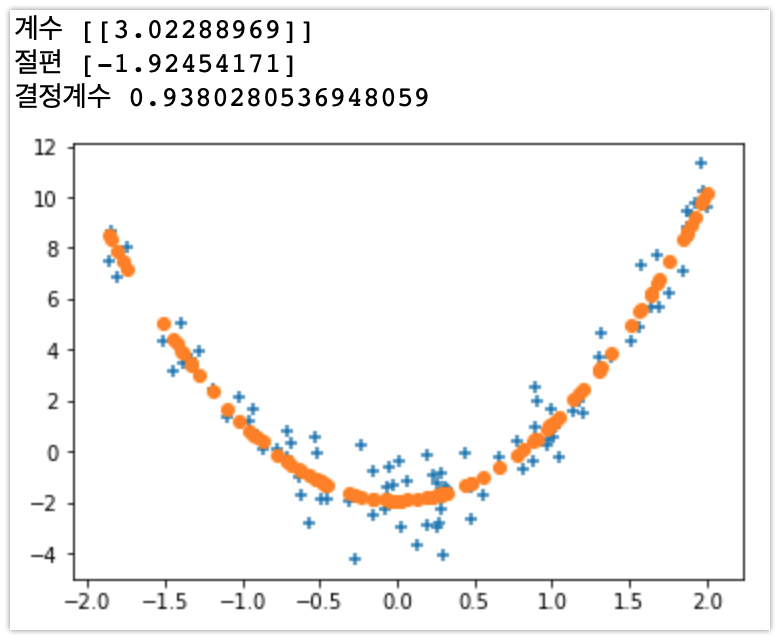

# 회귀

회귀는 수치를 예측하는 지도 학습 문제이다. 학습 할 때 입력 데이터와 출력 데이터 셋에서 대응하는 규칙을 배우고 미지의 입력데이터에서 적절한 값을 출력(근사)하게 된다,

회귀의 기본 원리는 주어진 데이터에 대해 관계를 나타내는 식을 가정하고, 해당 데이터에 가장 알맞은 식의 계수를 정해 나간다는 것이다.




## 회기 문제의 분류

### 식의 형식으로 분류

- 선형회귀 : 위의 그림의 왼쪽 그래프처럼 데이터의 직선적인 관계를 추정하는 회귀이다. 식은 무조건 직선이 아닌 오른쪽의 곡선도 해당된다.

- 비선형회귀 : 선형 이외에 모든 회귀


### 변수 개수로 회귀

- 단순 회귀 : 입출력 관계가 변수하나로 구성된 식(y = ax + b) 을 상정해 푸는 회귀문제. 선형과 비선형으로 분류된다.
- 다중회귀 : 변수를 2개 이상 쓰는 회귀를 말한다(y = ax1 + bx2 + c) . 단순 회귀처럼 선형 비선형으로 구분된다.


## 최소 제곱법

회귀의 기본적인 개념인 최소 제곱법에 대해 알아보자. 이 그림에서 평면상의 점들의 관계를 잘 나타내는 선을 어떻게 만들 수 있을까?



그림에서의 점을 (x1, y1), (x2, y2), (x3, y3), (x4, y4)라 하고 직선을 y = f(x) 로 나타내자.

그렇다면 실제값(y1, y2, y3, y4)와 예측값(f(x1), f(x2), f(x3), f(x4))의 차이값이 가장 작아지는 직선을 구하면 오차가 가장 적을 것이다.



실제값(y)과 예측값(f(x)) 차이에 대한 제곱의 곱을 구성하고 이 값을 최소화하여 가장 적은 오차로 점들의 값을 모델링한 선(혹은 곡선)을 구할 수 있다.

Scikit-learn에는 최소제곱법을 구현한 sklearn.linear_model.LinearRegression 클래스가 있으므로 활용해보자.


# 선형 단순 회귀

우선 간단한 선형 단순 회귀로 앞에서 이야기한 원리를 활용해보자. 단순 회귀가 변수 하나로 성립되는 식을 상정한다면 변수는 데이터셋에서 속성값 하나를 의미한다.

예를 들어 사람에 대한 데이터셋이라면 이름, 나이, 주소 등 여러 속성중 하나(나이)만 활용하는 것이라 할 수 있다.

y = ax + b라는 식의 형태인 직선으로 식을 가정하고 진행해보자

우선 데이터를 y = 3x - 2로 데이터를 만들어 보자

```python
import matplotlib.pyplot as plt
import numpy as np

x = np.random.rand(100, 1)
x = x * 4 - 2 # 값 범위를 -2 ~ 2로 지정
y = 3 * x - 2
plt.scatter(x,y,marker='+')
```



x와 y관계에서 최소제곱법으로 회귀 직선을 구해보자. sklearn.linear_model.LinearRegression 객체를 사용해 다음과 같이 계산하자. 패키지로부터 객체를 불러왔고 fit() 메서드로 x, y 데이터를 학습시켰다.

```python
from sklearn import linear_model

model = linear_model.LinearRegression()
model.fit(x,y)
```


앞에서 가정한 식 y = ax + b에서 계수 a는 model.coef_ 값을 출력해 확인하고, 절편 b값은 model.intercept_ 값을 출력해 알 수 있다.

```python
print(model.coef_)
print(model.intercept_)
```



앞에서 의도적으로 데이터를 y = 3x - 2 식으로 만들었던 것과 같은 결과가 나타났다. 다음은 약간의 오차를 주어보자. 다음과 같이 난수로 데이터를 만들어 학습 시키자.

```python
x = np.random.rand(100,1)
x = x * 4 - 2 # 값 범위를 -2 ~ 2로 지정
y = 3 * x - 2

y += np.random.randn(100, 1) # 약간의 난수를 더해준다.
```

모델에 적용시켜보자 동그라미로 표시된 부분은 학습데이터를 통해 구성한 직선이다.

```python
model = linear_model.LinearRegression()
model.fit(x,y)

plt.scatter(x, y, marker='+')
plt.scatter(x, model.predict(x), marker='o')

print(model.coef_)
print(model.intercept_)
```



이전처럼 a가 3이고 b가 -2이었던 것 처럼 뚜렸하게 값이 나오지는 않았지만 대략적인 근사값이 나오는 것을 확인 할 수 있다.


# 회귀 평가

회귀 후의 결과의 타당성을 따져보기 위해 평가하는 지표로 결정 계수를 활용한다. 결정계수 R^2는 다음과 같이 정의할 수 있다.



관측값과 예측값의 차이가 적으면 결정 계수는 1에 가까워지며, 차이가 크면 0에 가까워진다(위 식에서 분자를 볼 것). 따라서 결정 계수 값이 1에 가까워 질 수록 좋은 모델이라 할 수 있다. sklearn.linear_model의 각 클래스에는 score 함수를 활용하여 결정 계수를 구할 수 있다.

```python
print(model.score(x,y))
```




## 2차 방정식을 상정

이전의 예시에서는 직선을 가정하였지만 데이터를 모델링한 식이 무조건 직선이 아니어도 된다. 여기서는 2차 방정식의 곡선으로 회귀를 해본다.

y = ax^2 + b의 식으로 상정해 보자.

일단 데이터를 y = 3x^2 - 2로 데이터를 작성하고 오차도 설정하였다.

```python
## 분산 y = 3x -2 데이터를 생성
x = np.random.rand(100, 1)  # 0~1까지 난수를 100개 만든다
x = x * 4 - 2               # 값의 범위를 -2~2로 변경
y = 3 * x**2 - 2  # y = 3x^2 - 2

y += np.random.randn(100, 1)  # 표준 정규 분포(평균 0, 표준 편차 1)의 난수를 추가함
```

 sklearn.linear_model.LinearRegression의 fit() 메서드로 데이터를 전달할 때, X를 제곱한 값을 전달하자.

```python
## 학습

from sklearn import linear_model

model = linear_model.LinearRegression()
model.fit(x**2, y)  # x를 제곱해 전달
```

학습 시킨 모델을 통해 그래프를 표시해 보면 +는 데이터의 값이고, 동그라미는 데이터의 관계를 모델링한 결과를 표시한 것이다.

```python
plt.scatter(x, y, marker ='+')
plt.scatter(x, model.predict(x**2), marker='o')  # predict에도 x를 제곱해 전달

print('계수', model.coef_)
print('절편', model.intercept_)
print('결정계수', model.score(x**2, y))
```

