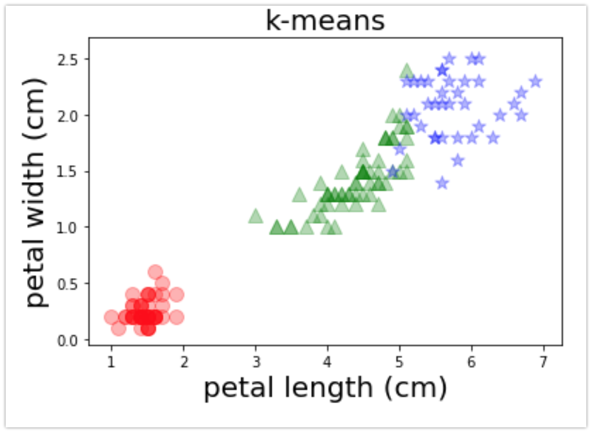

# 회귀

회귀는 수치를 예측하는 지도 학습 문제이다. 학습 할 때 입력 데이터와 출력 데이터 셋에서 대응하는 규칙을 배우고 미지의 입력데이터에서 적절한 값을 출력(근사)하게 된다,

회귀의 기본 원리는 주어진 데이터에 대해 관계를 나타내는 식을 가정하고, 해당 데이터에 가장 알맞은 식의 계수를 정해 나간다는 것이다.


## 회기 문제의 분류

### 식의 형식으로 분류

- 선형회귀 : 위의 그림의 왼쪽 그래프처럼 데이터의 직선적인 관계를 추정하는 회귀이다. 식은 무조건 직선이 아닌 오른쪽의 곡선도 해당된다.

- 비선형회귀 : 선형 이외에 모든 회귀


### 변수 개수로 회귀

- 단순 회귀 : 입출력 관계가 변수하나로 구성된 식(y = ax + b) 을 상정해 푸는 회귀문제. 선형과 비선형으로 분류된다.
- 다중회귀 : 변수를 2개 이상 쓰는 회귀를 말한다(y = ax1 + bx2 + c) . 단순 회귀처럼 선형 비선형으로 구분된다.


## 최소 제곱법

회귀의 기본적인 개념인 최소 제곱법에 대해 알아보자. 이 그림에서 평면상의 점들의 관계를 잘 나타내는 선을 어떻게 만들 수 있을까?


그림에서의 점을 (x1, y1), (x2, y2), (x3, y3), (x4, y4)라 하고 직선을 y = f(x) 로 나타내자.

그렇다면 실제값(y1, y2, y3, y4)와 예측값(f(x1), f(x2), f(x3), f(x4))의 차이값이 가장 작아지는 직선을 구하면 오차가 가장 적을 것이다.


실제값(y)과 예측값(f(x)) 차이에 대한 제곱의 곱을 구성하고 이 값을 최소화하여 가장 적은 오차로 점들의 값을 모델링한 선(혹은 곡선)을 구할 수 있다.

Scikit-learn에는 최소제곱법을 구현한 sklearn.linear_model.LinearRegression 클래스가 있으므로 활용해보자.


# 선형 단순 회귀

우선 간단한 선형 단순 회귀로 앞에서 이야기한 원리를 활용해보자. 단순 회귀가 변수 하나로 성립되는 식을 상정한다면 변수는 데이터셋에서 속성값 하나를 의미한다.

예를 들어 사람에 대한 데이터셋이라면 이름, 나이, 주소 등 여러 속성중 하나(나이)만 활용하는 것이라 할 수 있다.

y = ax + b라는 식의 형태인 직선으로 식을 가정하고 진행해보자

우선 데이터를 y = 3x - 2로 데이터를 만들어 보자

```python
import matplotlib.pyplot as plt
import numpy as np

x = np.random.rand(100, 1)
x = x * 4 - 2 # 값 범위를 -2 ~ 2로 지정
y = 3 * x - 2
plt.scatter(x,y,marker='+')
```


x와 y관계에서 최소제곱법으로 회귀 직선을 구해보자. sklearn.linear_model.LinearRegression 객체를 사용해 다음과 같이 계산하자. 패키지로부터 객체를 불러왔고 fit() 메서드로 x, y 데이터를 학습시켰다.

```python
from sklearn import linear_model

model = linear_model.LinearRegression()
model.fit(x,y)
```


앞에서 가정한 식 y = ax + b에서 계수 a는 model.coef_ 값을 출력해 확인하고, 절편 b값은 model.intercept_ 값을 출력해 알 수 있다.

```python
print(model.coef_)
print(model.intercept_)
```


앞에서 의도적으로 데이터를 y = 3x - 2 식으로 만들었던 것과 같은 결과가 나타났다. 다음은 약간의 오차를 주어보자. 다음과 같이 난수로 데이터를 만들어 학습 시키자.

```python
x = np.random.rand(100,1)
x = x * 4 - 2 # 값 범위를 -2 ~ 2로 지정
y = 3 * x - 2

y += np.random.randn(100, 1) # 약간의 난수를 더해준다.
```

모델에 적용시켜보자 동그라미로 표시된 부분은 학습데이터를 통해 구성한 직선이다.

```python
model = linear_model.LinearRegression()
model.fit(x,y)

plt.scatter(x, y, marker='+')
plt.scatter(x, model.predict(x), marker='o')

print(model.coef_)
print(model.intercept_)
```


이전처럼 a가 3이고 b가 -2이었던 것 처럼 뚜렸하게 값이 나오지는 않았지만 대략적인 근사값이 나오는 것을 확인 할 수 있다.


# 회귀 평가

회귀 후의 결과의 타당성을 따져보기 위해 평가하는 지표로 결정 계수를 활용한다. 결정계수 R^2는 다음과 같이 정의할 수 있다.


관측값과 예측값의 차이가 적으면 결정 계수는 1에 가까워지며, 차이가 크면 0에 가까워진다(위 식에서 분자를 볼 것). 따라서 결정 계수 값이 1에 가까워 질 수록 좋은 모델이라 할 수 있다. sklearn.linear_model의 각 클래스에는 score 함수를 활용하여 결정 계수를 구할 수 있다.

```python
print(model.score(x,y))
```


# 2차 방정식을 상정

이전의 예시에서는 직선을 가정하였지만 데이터를 모델링한 식이 무조건 직선이 아니어도 된다. 여기서는 2차 방정식의 곡선으로 회귀를 해본다.

y = ax^2 + b의 식으로 상정해 보자.

일단 데이터를 y = 3x^2 - 2로 데이터를 작성하고 오차도 설정하였다.

```python
## 분산 y = 3x -2 데이터를 생성
x = np.random.rand(100, 1)  # 0~1까지 난수를 100개 만든다
x = x * 4 - 2               # 값의 범위를 -2~2로 변경
y = 3 * x**2 - 2  # y = 3x^2 - 2

y += np.random.randn(100, 1)  # 표준 정규 분포(평균 0, 표준 편차 1)의 난수를 추가함
```

 sklearn.linear_model.LinearRegression의 fit() 메서드로 데이터를 전달할 때, X를 제곱한 값을 전달하자.

```python
## 학습

from sklearn import linear_model

model = linear_model.LinearRegression()
model.fit(x**2, y)  # x를 제곱해 전달
```

학습 시킨 모델을 통해 그래프를 표시해 보면 +는 데이터의 값이고, 동그라미는 데이터의 관계를 모델링한 결과를 표시한 것이다.

```python
plt.scatter(x, y, marker ='+')
plt.scatter(x, model.predict(x**2), marker='o')  # predict에도 x를 제곱해 전달

print('계수', model.coef_)
print('절편', model.intercept_)
print('결정계수', model.score(x**2, y))
```


# 다중 회귀

다중 회귀는 변수를 여러 개 사용하는 식(예 : y = ax1 + bx2  + …  + c)을 상정해 푸는 회귀문제이다. 앞에서와  마찬가지로  y = ax1 + bx2  + c 관계가 되는 데이터를 만들어 회귀문제를 실습해보자 우선 a = 3, b = -2, c = 1로 데이터를 구성해보자.

```python
import matplotlib.pyplot as plt
import numpy as np

x1 = np.random.rand( 100, 1 )   # 0~1까지 난수를 100개 만들
x1 = x1 * 4 - 2                 # 값의 범위를 -2~2로 변경

x2 = np.random.rand( 100, 1 )   # x2에 대해서도 마찬가지
x2 = x2 * 4 - 2

y = 3 * x1 - 2 * x2 + 1
```

x1과 y, x2와 y를 확인하기 위해 산포도를 구성하였다.

```python
plt.subplot( 1, 2, 1 )
plt.scatter( x1, y, marker='+' )
plt.xlabel( 'x1' )
plt.ylabel( 'y' )

plt.subplot( 1, 2, 2 )
plt.scatter( x2, y, marker='+' )
plt.xlabel( 'x2' )
plt.ylabel( 'y' )
```


이제 x1, x2와 y의 관계에 대해 LinearRegression 객체를 활용하여 분석해보자. 학습 데이터로 x1과 x2를 np.c_를 활용해 하나로 묶어 데이터를 전달하자.

```python
from sklearn import linear_model


x1_x2 = np.c_[x1, x2]  # [[x1_1, x2_1], [x1_2, x2_2], ..., [x1_100, x2_100]]
                       # 형태로 변환

model = linear_model.LinearRegression()
model.fit(x1_x2, y)
```

모델을 학습 시킨 후에 계수, 절편, 결정계수 등을 확인해보자.

```python
### 계수, 절편, 결정 계수를 표시

print('계수', model.coef_)
print('절편', model.intercept_)
print('결정계수', model.score(x1_x2, y))

```


앞에서 가정했던 식(y = ax1 + bx2  + c)의 a, b, c 값(a = 3, b = -2, c = 1)과 결정계수를 비교해보면 학습이 잘 된 것을 확인할 수 있다

별도의 선을 그리지 않고 원본데이터(+)와 예측점(o)를 겹처서 그렸다. 정확하게 원본 데이터 위에 예측 값이 겹쳐서 표현됨을 확인 할 수 있다.

```python
### 그래프 표시

y_ = model.predict(x1_x2)  # 구한 회귀식으로 예측

plt.subplot(1, 2, 1)
plt.scatter(x1, y, marker='+')
plt.scatter(x1, y_, marker='o')
plt.xlabel('x1')
plt.ylabel('y')

plt.subplot(1, 2, 2)
plt.scatter(x2, y, marker='+')
plt.scatter(x2, y_, marker='o')
plt.xlabel('x2')
plt.ylabel('y')
```


이번에는 데이터에 오차를 주어 확인해보자. 위의 예제에서 데이터를 만드는 코드 부분에 아래 코드를 추가하자.


```python
...
# 앞에서 작성한 부분(시작)
x2 = np.random.rand( 100, 1 )   # x2에 대해서도 마찬가지
x2 = x2 * 4 - 2

y = 3 * x1 - 2 * x2 + 1
# 앞에서 작성한 부분(끝)

# y값에 오차를 주어 표시한다.
y += np.random.randn( 100, 1 )	# 표준 정규 분포(평균0, 표준 편차1) 오차 표현을 위해 난수를 더한다
...
```

앞에서 처럼 데이터를 학습시키고 계수와 절편을 확인한다. 가정했던 값 (a = 3, b = -2, c = 1)과 유사하지만 계수와 절편, 결정 계수에 오차가 반영됨을 알 수 있다.

```
from sklearn import linear_model


x1_x2 = np.c_[x1, x2]  # [[x1_1, x2_1], [x1_2, x2_2], ..., [x1_100, x2_100]]
                       # 형태로 변환

model = linear_model.LinearRegression()
model.fit(x1_x2, y)


print('계수', model.coef_)
print('절편', model.intercept_)
print('결정계수', model.score(x1_x2, y))
```


앞에서와 마찬가지로 원본 데이터와 예측값을 겹처 사점도를 그려 보았다. 대체로 데이터의 분포는 유사하게 예측값을 산출해 냈지만 원본 데이터와 예측값이 겹치지 않는 곳이 보인다.


# 회귀에서 과적합 문제

과적합은 주어진 학습 데이터에 너무 적응해서 미지의 데이터에 적합하지 않은 상태이다. 과적합된 모델은 제대로 된 값을 추정할 수 없다. 일단 회귀에서 과적합의 사례를 들어 확인해보자.

일단 다음 식으로 가정을 하고 데이터를 작성하자.

y = 4x^3 - 3x^2 + 2x - 1

데이터는 오차를 적용하여 학습은 30개 검증 데이터는 70개를 준비한다.

```python
import matplotlib.pyplot as plt
import numpy as np

x = np.random.rand(100, 1)      # 0~1까지 난수를 100개 만든다
x = x * 2 - 1                   # 값의 범위를 -2~2로 변경

y = 4 * x * 3 - 3 * x * 2 + 2 * x - 1

y += np.random.randn( 100, 1 )  # 표준 정규 분포(평균0, 표준 편차1)
                               #난수를 더한다
# 학습 데이터 30개
x_train = x[:30]
y_train = y[:30]

# 테스트 데이터 70개
x_test = x[30:]
y_test = y[30:]
```

모든 데이터와 학습, 검증 데이터를 산포도로 표시해 놓은 플롯이다.

```python
plt.subplot( 2, 2, 1 )
plt.scatter( x, y, marker='+' )
plt.title( 'all' )
plt.subplot( 2, 2, 2 )
plt.scatter( x_train, y_train, marker='+' )
plt.title( 'train' )

plt.subplot( 2, 2, 3 )
plt.scatter( x_test, y_test, marker='+' )
plt.title( 'test' )
```


데이터를 만들었고 앞에서 추정한 회귀식(y = 4x^3 - 3x^2 + 2x - 1)을 알 수 없다고 가정하자. 그리하여 9차식의 LinearRegression으로 학습을 진행한다.

모델 객체에 데이터를 전달하기 위해 np_c로 9개의 변수 값을 전달한다. 이후 fit()함수를 활용해 데이터를 학습시켜 보자.

```python
# 학습용 입력 데이터
X_TRAIN = np.c_[x_train**9, x_train**8, x_train**7, x_train**6, x_train**5,
                x_train**4, x_train**3, x_train**2, x_train]

model = linear_model.LinearRegression()
model.fit(X_TRAIN, y_train)
```


학습한 결과를 확인하기 위해 계수와 절편, 결정계수를 확인하고 그래프를 그려보자. 테스트 데이터에 대해 높은 결정계수가 나오는 것을 확인할 수 있다.

```python
### 계수, 절편, 학습 데이터에 의한 결정계수를 표시

print('계수（학습 데이터）', model.coef_)
print('절편（학습 데이터）', model.intercept_)

print('결정계수（학습 데이터）', model.score(X_TRAIN, y_train))
```


이제 테스트 데이터로 모델을 확인해보자. 학습 데이터와 비교해 나쁜 결정계수가 나타났다. 

```python
### 테스트 데이터에 의한 결정계수를 표시

X_TEST = np.c_[x_test**9, x_test**8, x_test**7, x_test**6, x_test**5,
               x_test**4, x_test**3, x_test**2, x_test]

print('결정계수（테스트 데이터）', model.score(X_TEST, y_test))
```


이는 학습 데이터에 비해 모델이 너무 복잡하기 때문(모델 복잡도가 높다)이다. 그리하여 과적합이 발생한 것이다.


## 과적합 대응 

앞에서 설명한 회귀의 기초 원리인 최소 제곱법은 예측값과 실제 값 오차의 제곱값을 최소로 하는 방법이다. 여기서 최소화의 대상이 오차 뿐만 아니라 모델의 복잡도를 고려한 회기 분석 방법 중 리지(ridge) 회귀 방법을 소개한다.


리지 회귀 모델은 sklearn.linear_model.Ridge에 구현되어 있다. 사용법은 앞에서 이야기한 LinearRegression과 같다.

```python
### Ridge 로 9차식으로서 회귀를 취해 본다
from sklearn import linear_model

# 학습용의 입력 데이터
X_TRAIN = np.c_[x_train**9, x_train**8, x_train**7, x_train**6, x_train**5,
                x_train**4, x_train**3, x_train**2, x_train]

model = linear_model.Ridge()
model.fit(X_TRAIN, y_train)
```

앞의 LinearRegression 모델에서 과적합이었던 테스트 데이터를 리지 모델에 적용하여 확인해보자. 결정계수가 높은 수치로 개선됨을 확인할 수 있다.

```python
### 테스트 데이터에 의한 결정계수를 표시

X_TEST = np.c_[x_test**9, x_test**8, x_test**7, x_test**6, x_test**5,
               x_test**4, x_test**3, x_test**2, x_test]

print('결정계수（테스트 데이터）', model.score(X_TEST, y_test))
```


# 클러스터링

클러스터링은 데이터의 성질에서 데이터 군집(클러스터)를 만드는 방법이다. 2차원의 데이터를 산포도로 그리면 대략적인 배치와 구조를 알 수 있지만 다차원이고 대량이면 파악하기가 어렵다. 이를 위해 클러스터링을 활용하여 분류한다.


여기서는 클러스터링의 대표적인 알고리즘인 k-means 알고리즘을 알아본다. 이 알고리즘은 1950년에 제안된 방법이지만 계산이 간단하고 직관적이므로 이해하기 좋다. k-means 클러스터링은 클러스터 개수(k)를 미리 지정하고 데이터간의 거리를 통해 클러스터를 구성하게 된다.

1. 클러스터의 갯수(그림에서는 5개의 빨간점)만큼 임의의 중심값(기준값)을 선택한다.
2. 각 데이터에서 중심값의 거리를 구한다. 데이터는 거리가 가장 짧은 중심점에 속한 클러스터로 소속된다.
3. 클러스터에 소속된 데이터끼리 중심점을 재계산한다.
4. 데이터들의 클러스터가 바뀌지 않을 때까지 2, 3을 반복한다.


그림으로 각 순서를 파악해 보자

- 클러스터의 갯수(그림에서는 5개의 빨간점)만큼 임의의 중심값(기준값)을 선택한다.


- 각 데이터에서 중심값의 거리를 구한다. 데이터는 거리가 가장 짧은 중심점에 속한 클러스터로 소속된다.


- 클러스터에 소속된 데이터끼리 중심점을 재계산한다.


- 데이터들의 클러스터가 바뀌지 않을 때까지 2, 3을 반복한다.


- 최종 결과


# K-means 실행

실습을 위해서 데이터로는 iris 데이터셋을 활용하여 붓꽃의 특징에 따라 품종을 클러스터링으로 구분해볼 것이다. 일단 데이터셋을 준비해보자.

```python
from sklearn import datasets

iris = datasets.load_iris()
data = iris['data']
```

 

k-means알고리즘을 구현한 모듈은 sklearn.cluster 모듈로 임포트해 주자. 이후 KMeans() 메서드를 호출하고 클러스터의 수(n_clusters)를 지정해주어 객체를 생상한다.

```python
from sklearn import cluster

# 학습 → 클러스터 생성
model = cluster.KMeans(n_clusters=3)
model.fit(data)
```


## 클러스터링 결과

클러스터는 생성한 모델에 변수로 저장되어 있다. 각 변수에 저장되는 데이터는 다음과 같다.

- cluster*centers* : 클러스터의 중심좌표 (n 개)
- labels_ : 각 점에 대한 레이블
- inertia_ : 각 데이터 점에서 소속된 클러스터 중심까지 거리 총합

이 변수 값을을 출력하면 다음과 같이 나타난다.

```python
print(model.cluster_centers_)
print(model.labels_)
print(model.inertia_)
```


## 결과의 가시화

클러스터링 된 결과물을 플롯을 그려 표현해 본다. 각 데이터는 네가지 속성 값이 있지만 꽃잎 길이(petal length)와 폭(petal width)를 기준으로 클러스터링 결과를 산포도를 그려 보았다.

```
iris["feature_names"]
```


인덱스의 순서로 꽃잎 길이와 폭은 2와 3이다.

```python
x_index = 2
y_index = 3

data_x=data[:,x_index]
data_y=data[:,y_index]

x_label = iris["feature_names"][x_index]
y_label = iris["feature_names"][y_index]

# 학습 결과의 라벨 취득
labels = model.labels_

# 산포도 그리기
plt.scatter(data_x[labels==0], data_y[labels==0],c='r' ,alpha=0.3, s=100, marker="o")
plt.scatter(data_x[labels==1], data_y[labels==1],c='g' ,alpha=0.3, s=100, marker="^")
plt.scatter(data_x[labels==2], data_y[labels==2],c='b' ,alpha=0.3, s=100, marker="*")

# 축 라벨과 타이틀 설정
plt.xlabel(x_label,fontsize='20')
plt.ylabel(y_label,fontsize='20')
plt.title("k-means",fontsize='20')
```

3 개의 클러스터가 분리되어 있으며 이를 꽃잎의 너비와 길이의 시점에서 살펴보았다.



모든 속성 4개중 2개만 추려 그림을 그려보면 다음과 같이 나타난다.


## 꽃의 종류와 클러스터 관계

각 데이터의 붓꽃 종류를 알고 있으므로 클러스터 결과와 비교해 보자. 꽃의 종류를 정답으로 진단하면 분류 문제 처럼 혼동 행렬을 활용해 볼 수 있다.

```python
from sklearn import metrics
print(metrics.confusion_matrix(iris['target'], model.labels_))
```


품종마다 0~2로 값이 지정되어 있기 때문에 이름을 출력하여 확인하자.

```
iris['target_names']
```


setosa는 0, versicolor는 1, virginica는 2임을 확인하자.


혼동 행렬을 보면 setosa는 완전히 분류하였고 versicolor와 virginica 분류는 혼동된 경우가 보인다. 그렇지만 어느 정도는 꽃의 종류와 클러스터가 대응 됨을 볼 수 있다. 

예측의 정답률도 확인해 보았다.

```python
print(metrics.accuracy_score(iris['target'], model.labels_))
```


## Iris 데이터셋을 활용한 k-means 클러스터링과 3D 플로팅

다음은 k-means 클러스터링 경과를 3D의 플롯으로 그려 보았다.


 클러스터링 객체를 만들어 데이터를 학습시키는 부분이다. 앞에서 학습한 내용과 같다.

```python
from sklearn import datasets
import numpy as np
from sklearn.cluster import KMeans

# iris 데이터셋 로드
iris = datasets.load_iris()

# 다음 코드를 실행항 iris 데이터셋의 설명을 볼 수 있다.
# print(iris.DESCR)

print('Features:'+str(iris.feature_names))
X = iris.data # 꽃받침 길이, 꽃받침 너비, 꽃잎 길이, 꽃잎 너비
# print(X)

print('Labels'+str(iris.target_names))
Y = iris.target # iris의 데이터 (0 : setosa, 1 : versicolor, 2 : virginica)

# k-means 모델을 사용하기 위한 모듈 임포트
from sklearn.cluster import KMeans

# 클러스터의 수를 지정
k_means = KMeans(n_clusters=3)

# 데이터를 학습시킨다.
k_means.fit(X)

# 모델이 클러스터링을 수행 한다(별도의 검증데이터 없이 바로 학습데이터를 활용함).
k_means_predicted = k_means.predict(X)
```

아래 부분은 데이터를 구분하고 3d 산점도를 그리는 코드이다.

```python
# 3d 플로팅을 위한 모듈 임포트
from mpl_toolkits import mplot3d

# 클러스터에서 중앙값 데이터를 저장
centroids = k_means.cluster_centers_

target_names = iris.target_names

plt.figure('Iris dataset', figsize=(7,5))
ax = plt.axes(projection = '3d')

# 검증된 내용을 부울행렬로 구성한뒤 데이터 분류
pred_part1 = k_means_predicted == 0 # setosa
pred_part2 = k_means_predicted == 1 # versicolor
pred_part3 = k_means_predicted == 2 # virginica

# 모델이 구분한 데이터를 산포도로 출력
# setosa 산포도
ax.scatter(X[pred_part1, 3], # x 축에는 petal width(꽃잎 너비)
           X[pred_part1, 0], # y 축에는 sepal length(꽃밭침 길이)
           X[pred_part1, 2], # z 축에는 petal length(꽃잎 길이)
           alpha=0.3, s=20, c='g', label='setosa')

# versicolor 산포도
ax.scatter(X[pred_part2, 3], 
           X[pred_part2, 0],
           X[pred_part2, 2], 
           alpha=0.3, s=20, c='y', label='virsicolor')

# virginica 산포도
ax.scatter(X[pred_part3, 3], 
           X[pred_part3, 0],
           X[pred_part3, 2], 
           alpha=0.3, s=20, c='c', label='virginica')


# 중앙값 데이터를 출력한다.
ax.scatter(centroids[0,3],centroids[0,0],centroids[0,2],
           c='r', s=100, label='centroid')
ax.scatter(centroids[1,3],centroids[1,0],centroids[1,2],
           c='r', s=100)
ax.scatter(centroids[2,3],centroids[2,0],centroids[2,2],
           c='r', s=100)

ax.set_xlabel('petal width (cm)')
ax.set_ylabel('sepal length (cm)')
ax.set_zlabel('petal length (cm)')

ax.legend()
```


# Mean-Shift Clustering

Mean Shift 알고리즘은 데이터의 밀도를 파악하여 클러스터를 구성하는 알고리즘이다. 특정 데이터를 중심으로 일정 범위 안에 속한 데이터가 많으면 해당 데이터를 중심점으로 클러스터를 생성하게 된다. K-means 알고리즘처럼 클러스터의 갯수를 지정하지 않아도 클러스터를 구성할 수 있는 점이 특징이다.

Mean-Shift concept

https://www.youtube.com/watch?v=kmaQAsotT9s

일단 간단한 데이터를 구성하여 보자

```python
import numpy as np
import matplotlib.pyplot as plt

# 데이터를 생성
x_p = np.random.randint(100, size=100)
y_p = np.random.randint(100, size=100)
pos = np.c_[x_p, y_p]

plt.scatter(x_p, y_p)
```

 

```
from sklearn.cluster import MeanShift

# 클러스터링 알고리즘에 학습(bandwidth 값이 커질수록 데이터의 갯수를 탐색하는 범위가 커진다.)
clustering = MeanShift(bandwidth=30)
clustering.fit(pos)

print(clustering.labels_)

labels = clustering.labels_
types = np.unique(labels, return_index=False)

print(types)
```

4가지 종류의 클러스터가 나온 것을 확인하였다.


다음은 4 종류의 데이터를 산점도로 그린것이다.

```
# pos[labels == 0, 0] 0번 클러스터의 x좌표
# pos[labels == 2, 0] 2번 클러스터의 y좌표
plt.scatter(pos[labels == 0, 0], pos[labels == 0, 1], c='r', s=20)
plt.scatter(pos[labels == 1, 0], pos[labels == 1, 1], c='g', s=20)
plt.scatter(pos[labels == 2, 0], pos[labels == 2, 1], c='b', s=20)
plt.scatter(pos[labels == 3, 0], pos[labels == 3, 1], c='y', s=20)
```

